# Lecture 12 — ConfigMaps, Secrets & Ingress

**Author:** Vanukuri Manohar Reddy

**Course:** SST DevOps & Cloud [SWE]

## Overview

This session covers Kubernetes application configuration, secret management, and Layer 7 traffic routing using Ingress.

### Topics Covered

* ConfigMaps
* ConfigMap live updates
* Kubernetes Secrets
* Base64 encoding
* Secret newline gotchas
* Enterprise secret management
* ConfigMap + Secret injection
* Ingress Resources
* Ingress Controllers
* NGINX Ingress Controller
* Local DNS / `/etc/hosts`
* Path-based routing
* Host-based routing
* Hybrid routing
* TLS / HTTPS termination
* End-to-end multi-tier deployment
* Automation scripts
* Multi-document YAML

---

# Task 1 — Non-Sensitive Configuration Decoupling via ConfigMaps

## Objective

Decouple application runtime configuration from the container image using a Kubernetes `ConfigMap`.

The application configuration contains:

* `ENVIRONMENT`
* `LOG_LEVEL`
* `PORT`
* `DEFAULT_CURRENCY`
* `MAX_BOOKING_DAYS`

## Commands

```bash
kubectl apply -f 01-configmap/app-config.yaml

kubectl get configmap yatri-app-config

kubectl describe configmap yatri-app-config

kubectl get configmap yatri-app-config -o jsonpath='{.data.ENVIRONMENT}' && echo ""

kubectl get configmap yatri-app-config -o jsonpath='{.data.LOG_LEVEL}' && echo ""
```

The `describe` command verifies the stored configuration keys, while JSONPath allows individual values to be queried directly.

### Screenshot

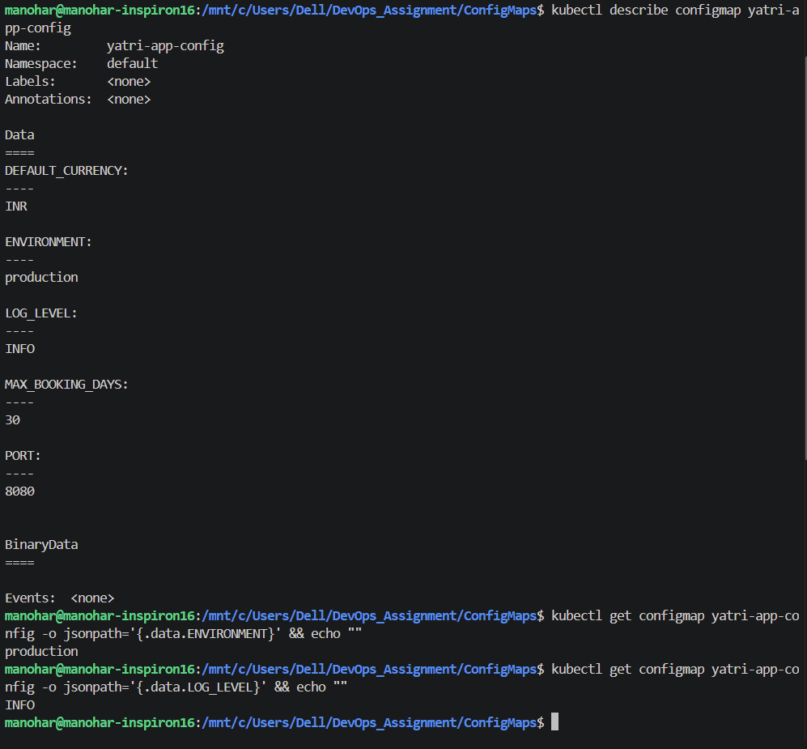

---

# Task 2 — ConfigMap Live Update & Pod Immobility Verification

## Objective

Demonstrate that changing a ConfigMap does not automatically change environment variables that were already injected into a running container.

A rolling restart is then used to load the updated configuration.

## Workflow

First change:

```text
ENVIRONMENT=production
```

to:

```text
ENVIRONMENT=staging
```

Then check the existing Pod, restart the Deployment, and check again.

## Commands

```bash
kubectl patch configmap yatri-app-config --type merge -p '{"data":{"ENVIRONMENT":"staging"}}'

kubectl exec -it deploy/yatri-backend -- env | grep ENVIRONMENT

kubectl rollout restart deployment/yatri-backend

kubectl rollout status deployment/yatri-backend

kubectl exec -it deploy/yatri-backend -- env | grep ENVIRONMENT
```

The existing Pod should initially continue showing:

```text
ENVIRONMENT=production
```

After the rolling restart, the newly created Pod should show:

```text
ENVIRONMENT=staging
```

Restore the original value:

```bash
kubectl patch configmap yatri-app-config --type merge -p '{"data":{"ENVIRONMENT":"production"}}'

kubectl rollout restart deployment/yatri-backend

kubectl rollout status deployment/yatri-backend
```

### Screenshot

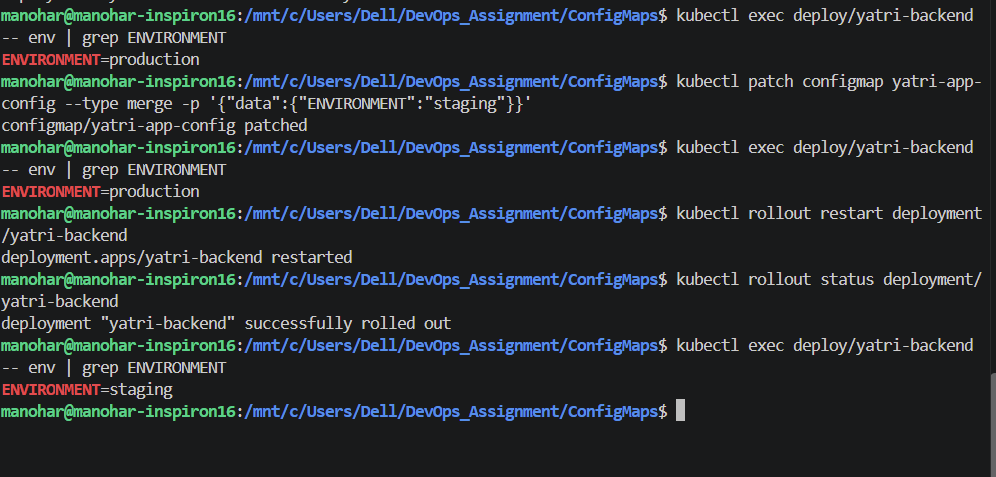

---

# Task 3 — Sensitive Data Isolation via Kubernetes Secrets

## Objective

Create a Kubernetes `Secret` containing database credentials.

Kubernetes Secrets use Base64 encoding for values stored in the API representation. Base64 is **encoding, not encryption**.

## Commands

```bash
kubectl apply -f 02-secret/db-secret.yaml

kubectl get secret yatri-db-secret

kubectl describe secret yatri-db-secret

kubectl get secret yatri-db-secret -o jsonpath='{.data.POSTGRES_PASSWORD}' | base64 --decode && echo ""

kubectl get secret yatri-db-secret -o jsonpath='{.data.POSTGRES_USER}' | base64 --decode && echo ""
```

The `describe` command displays the secret keys and byte lengths rather than revealing the values.

The decoded values should show:

```text
secretpassword
yatri_admin
```

### Screenshot

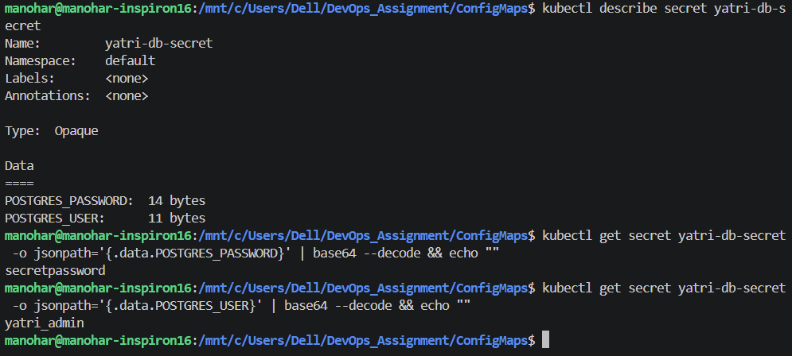

---

# Task 4 — Trailing Newline Secret Gotcha

## Objective

Demonstrate how standard `echo` adds a newline character and how that changes the Base64 payload.

## Commands

### Incorrect pattern

```bash
echo "secretpassword" | xxd

echo "secretpassword" | base64
```

The hexadecimal output should contain:

```text
0a
```

which represents the newline character.

### Correct pattern

```bash
echo -n "secretpassword" | xxd

echo -n "secretpassword" | base64
```

The clean Base64 value should be:

```text
c2VjcmV0cGFzc3dvcmQ=
```

The version containing the newline should be:

```text
c2VjcmV0cGFzc3dvcmQK
```

### Comparison

```bash
echo "Wrong (with newline): $(echo "secretpassword" | base64)"

echo "Right (no newline):   $(echo -n "secretpassword" | base64)"
```

### Screenshot

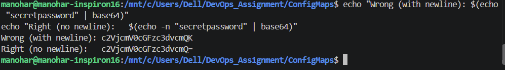

---

# Task 5 — Enterprise Secret Management & Pipeline Integration

## Objective

Understand why hardcoding Base64-encoded secrets in Git repositories is a security anti-pattern.

### Security Problem

Base64 does not protect a secret from someone who can read the encoded value.

Committing Kubernetes Secret manifests to Git can create problems such as:

* Secrets remaining in Git history
* Excessive repository access
* Difficulty rotating credentials
* Accidental exposure through logs or pull requests
* Long-term retention of sensitive values

### External Secret Management

A common enterprise architecture is:

```text
AWS Secrets Manager
        |
Azure Key Vault
        |
HashiCorp Vault
        |
        v
External Secrets Operator / Vault integration
        |
        v
Kubernetes Secret
        |
        v
Pod Environment / Volume
```

The external system acts as the authoritative secret store while Kubernetes receives the required secret material.

### CI/CD Integration

CI/CD platforms can also provide protected secret stores.

Example:

```text
GitHub Actions Secrets
        |
        v
Deployment Pipeline
        |
        v
Kubernetes
```

or:

```text
Azure DevOps Variable Groups
        |
        v
Deployment Pipeline
        |
        v
Kubernetes
```

The goal is to avoid storing plaintext credentials or reusable Base64-encoded credentials inside application source repositories.

## Cluster Check

```bash
kubectl get crds | grep -i secret || echo "Standard native secrets in use"
```

---

# Task 6 — Combined ConfigMap and Secret Pod Injection

## Objective

Deploy a backend that consumes both:

* Non-sensitive values from a ConfigMap
* Sensitive values from a Kubernetes Secret

The application uses:

```yaml
envFrom:
  configMapRef:
```

for bulk configuration injection and:

```yaml
env:
  valueFrom:
    secretKeyRef:
```

for individual secret values.

## Commands

```bash
kubectl apply -f 04-full-demo/configmap.yaml

kubectl apply -f 04-full-demo/secret.yaml

kubectl apply -f 04-full-demo/backend.yaml

kubectl rollout status deployment/yatri-backend
```

Verify the environment:

```bash
kubectl exec -it deploy/yatri-backend -- env | grep -E "ENVIRONMENT|LOG_LEVEL|POSTGRES|DEFAULT_CURRENCY"
```

### Screenshot

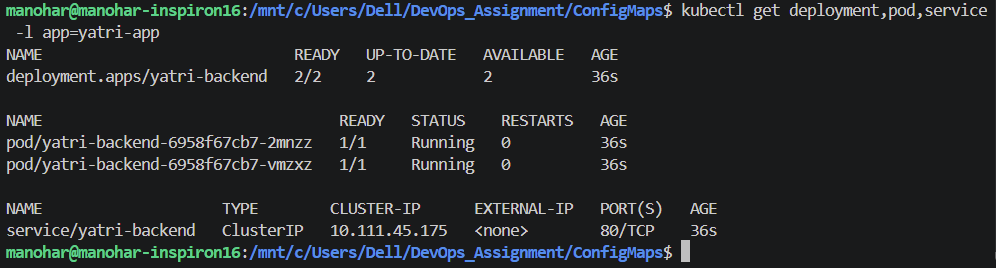

---

# Task 7 — Ingress Resource vs Ingress Controller

## Objective

Understand the difference between an Ingress Resource and an Ingress Controller.

## Ingress Resource

An Ingress Resource is a declarative Kubernetes API object.

It defines routing rules such as:

* Hostnames
* URL paths
* Backend Services
* TLS configuration

An Ingress Resource by itself does not route network traffic.

## Ingress Controller

An Ingress Controller is the active component that implements those rules.

Examples include:

* NGINX Ingress Controller
* Traefik
* HAProxy
* Envoy-based controllers

The controller watches Kubernetes resources through the API Server and configures its reverse-proxy/data-plane component accordingly.


Ingress Resource	Ingress Controller
Kubernetes API object	Actual software that processes traffic
Defines routing rules	Implements those rules
Specifies hosts, paths and backend Services	Receives HTTP/HTTPS traffic
Does not handle traffic by itself	Routes traffic to Services/Pods
Example: kind: Ingress	Example: NGINX Ingress Controller

### Architecture

```text
                 Kubernetes API Server
                         |
                         v
                 Ingress Resource
                 /     |       \
                /      |        \
               v       v         v
            Host     Path       TLS
               \       |        /
                \      |       /
                 v     v      v
              Ingress Controller
                       |
                       v
                 Backend Services
                       |
                       v
                      Pods
```

## Command

```bash
kubectl api-resources | grep -i ingress
```

---

# Task 8 — NGINX Ingress Controller Activation

## Objective

Enable the NGINX Ingress Controller addon in Minikube and verify that the controller becomes Ready.

## Commands

```bash
minikube addons enable ingress
```

Check the namespace:

```bash
kubectl get pods -n ingress-nginx
```

Wait for the controller:

```bash
kubectl wait --namespace ingress-nginx \
  --for=condition=ready pod \
  --selector=app.kubernetes.io/component=controller \
  --timeout=120s
```

Check the Service:

```bash
kubectl get service -n ingress-nginx
```

### Screenshot

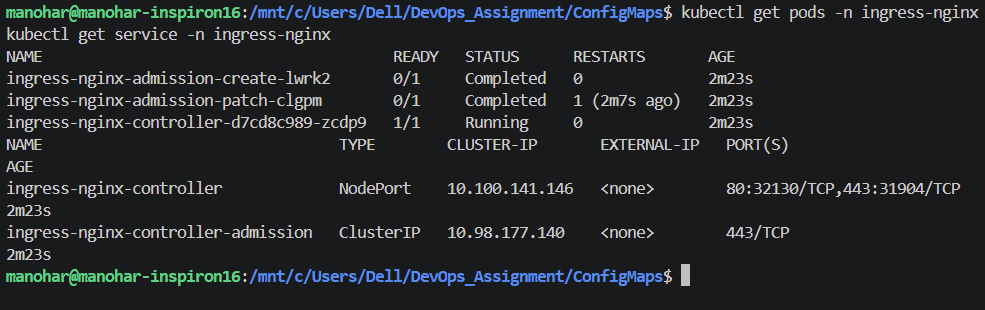
---

# Task 9 — Local DNS Resolution & Hosts File Mapping

## Objective

Map the Minikube IP to the local hostname:

```text
yatri.local
```

## Commands

Get the Minikube IP:

```bash
MINIKUBE_IP=$(minikube ip)

echo "Minikube IP is: ${MINIKUBE_IP}"
```

Add the hostname if it does not already exist:

```bash
if ! grep -q "yatri.local" /etc/hosts; then
  echo "${MINIKUBE_IP}  yatri.local" | sudo tee -a /etc/hosts
fi
```

Verify:

```bash
grep "yatri.local" /etc/hosts
```

Test resolution:

```bash
getent hosts yatri.local
```

### Screenshot

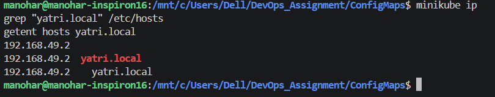
```

---

# Task 10 — Layer 7 Path-Based Routing

## Objective

Configure an Ingress that routes requests based on URL paths.

The architecture is:

```text
yatri.local/
       |
       v
Frontend Service
       |
       v
Frontend Pods


yatri.local/api/
       |
       v
Backend Service
       |
       v
Backend Pods
```

The backend path uses NGINX rewrite behavior.

## Commands

Deploy the frontend:

```bash
kubectl apply -f 04-full-demo/frontend.yaml
```

Deploy the backend:

```bash
kubectl apply -f 04-full-demo/backend.yaml
```

Apply the Ingress:

```bash
kubectl apply -f 04-full-demo/ingress.yaml
```

Verify:

```bash
kubectl get ingress yatri-ingress

kubectl describe ingress yatri-ingress
```

Test frontend:

```bash
curl -s http://yatri.local/ | grep -i "<title>"
```

Test backend:

```bash
curl -s http://yatri.local/api/
```

The root request should reach the frontend, while `/api/` should reach the backend.

### Screenshot


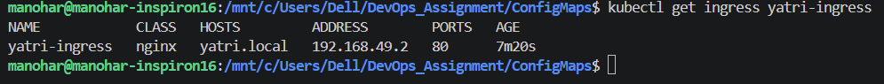

---

# Task 11 — Virtual Host-Based Routing

## Objective

Route requests based on hostname.

The architecture uses:

```text
portal.campus.local
        |
        v
Frontend Service


api.campus.local
        |
        v
Backend Service
```

Both hostnames can use the same Minikube IP.

## Commands

```bash
MINIKUBE_IP=$(minikube ip)

echo "${MINIKUBE_IP}  portal.campus.local api.campus.local" | sudo tee -a /etc/hosts
```

Verify:

```bash
grep -E "portal.campus.local|api.campus.local" /etc/hosts
```

Test the portal:

```bash
curl -s -H "Host: portal.campus.local" http://${MINIKUBE_IP}/ | grep -i "<title>"
```

Test the API:

```bash
curl -s -H "Host: api.campus.local" http://${MINIKUBE_IP}/api/
```

### Screenshot

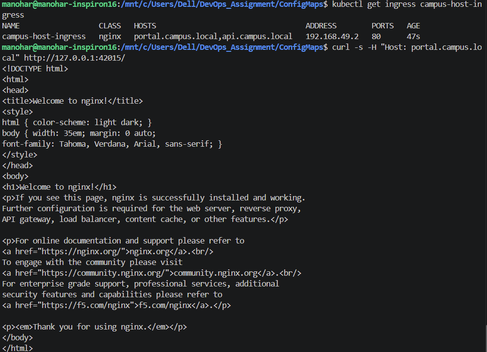

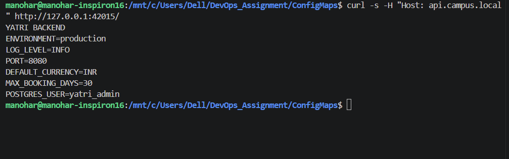

---

# Task 12 — Hybrid Ingress Routing

## Objective

Combine host-based and path-based routing in a single Ingress configuration.

Example:

```text
portal.campus.local/
        ↓
Frontend


api.campus.local/api/
        ↓
Backend
```

The Ingress can therefore use both:

* Host
* Path

to determine the backend destination.

## Commands

```bash
kubectl apply -f 03-ingress/ingress-tls.yaml

kubectl get ingress campus-ingress-tls

kubectl describe ingress campus-ingress-tls
```

### Screenshot

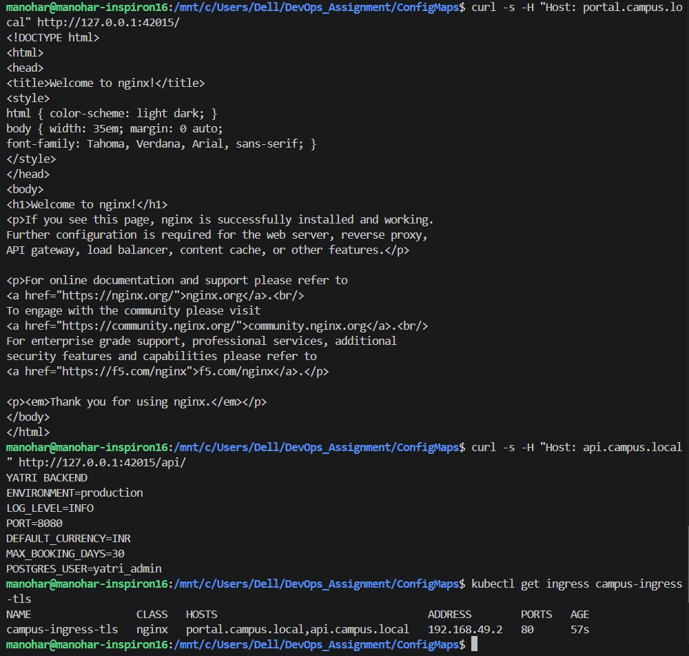

---

# Task 13 — Ingress TLS/HTTPS Termination

## Objective

Generate a self-signed TLS certificate, store it as a Kubernetes TLS Secret, and configure the Ingress to terminate HTTPS traffic.

## Step 1 — Generate certificate

```bash
openssl req -x509 -nodes -days 365 -newkey rsa:2048 \
  -keyout tls.key \
  -out tls.crt \
  -subj "/CN=campus.local/O=CampusDevOps"
```

## Step 2 — Create Kubernetes TLS Secret

```bash
kubectl create secret tls campus-tls-cert \
  --cert=tls.crt \
  --key=tls.key
```

Verify:

```bash
kubectl get secret campus-tls-cert
```

## Step 3 — Apply TLS Ingress

```bash
kubectl apply -f 03-ingress/ingress-tls.yaml

kubectl get ingress campus-ingress-tls
```

## Step 4 — Test HTTPS

```bash
INGRESS_IP=$(minikube ip)

curl -k -v \
  --resolve portal.campus.local:443:${INGRESS_IP} \
  https://portal.campus.local/ \
  2>&1 | grep -E "Server certificate|HTTP/|SSL connection"
```

The `-k` option allows curl to accept the self-signed certificate for this lab.

### Screenshot

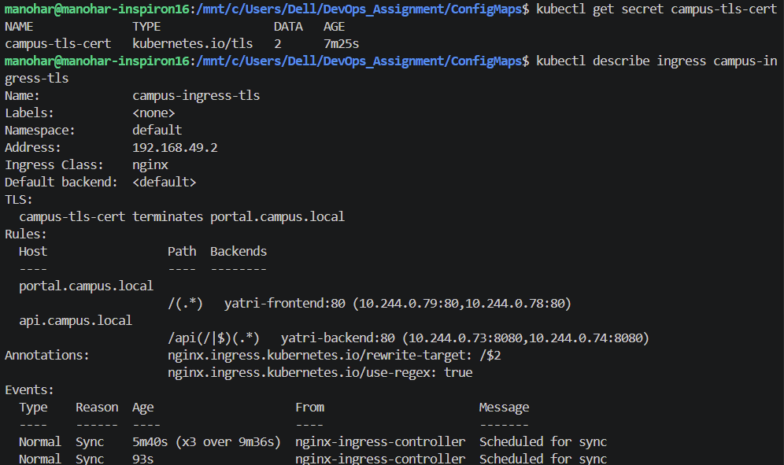

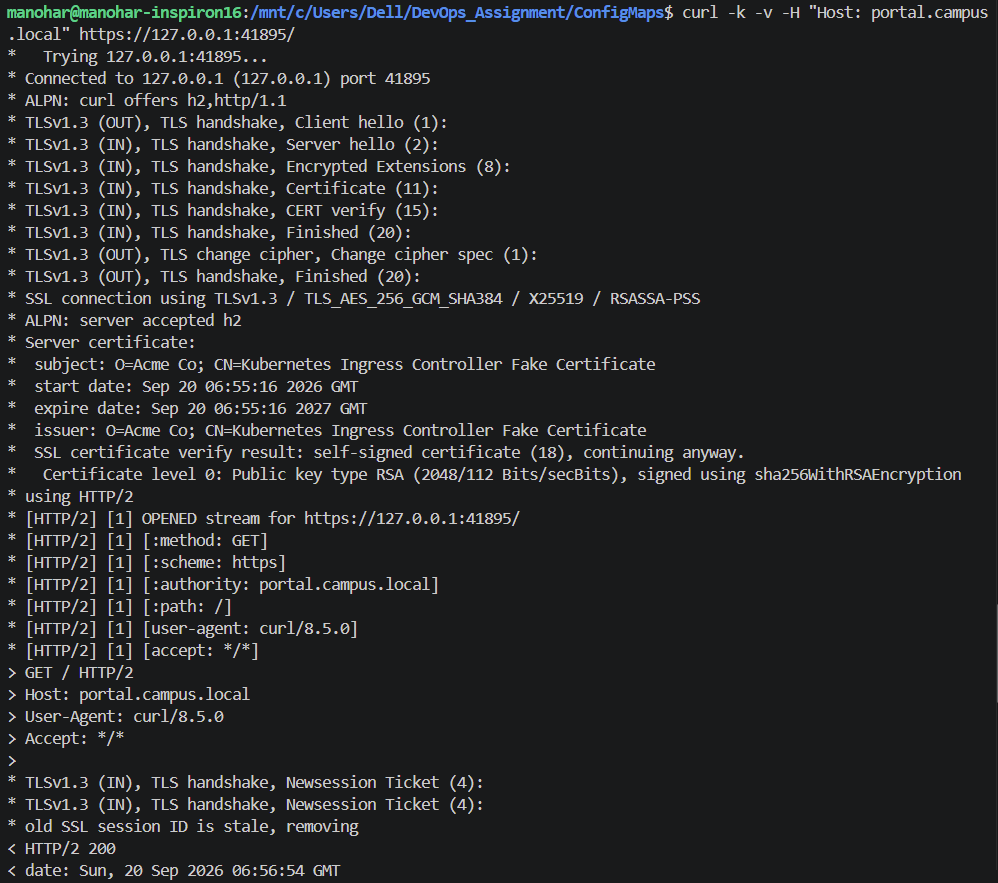

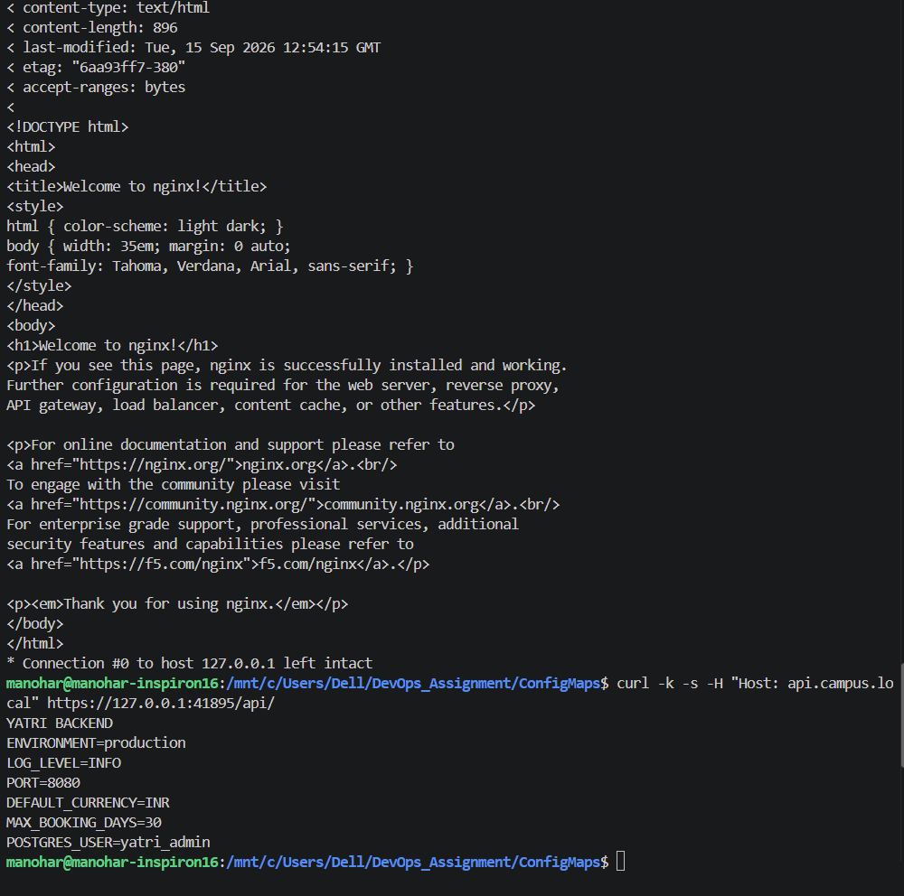
---

# Task 14 — End-to-End Multi-Tier Microservice Integration

## Objective

Deploy the complete Session 12 architecture and use automation scripts to deploy and remove the lab resources.

The architecture combines:

```text
                    Client
                       |
                       v
                    Ingress
                  /         \
                 /           \
                v             v
          Frontend Service  Backend Service
                |             |
                v             v
          Frontend Pods   Backend Pods
                              |
                    +---------+---------+
                    |                   |
                ConfigMap            Secret
```

## Multi-Document YAML

Some YAML files contain multiple Kubernetes resources separated using:

```text
---
```

For example:

```yaml
apiVersion: apps/v1
kind: Deployment
...

---
apiVersion: v1
kind: Service
...
```

This allows related resources to be stored in one manifest file.

## Step 1 — Run the automated deployment

```bash
bash 04-full-demo/run-demo.sh
```

## Step 2 — Audit the deployed stack

```bash
kubectl get configmap,secret,ingress,deploy,svc,pods -l app=yatri-app
```

## Step 3 — Run cleanup

```bash
bash 04-full-demo/cleanup.sh
```

## Step 4 — Verify cleanup

```bash
kubectl get ingress yatri-ingress || echo "Ingress deleted"

kubectl get deployment yatri-backend yatri-frontend || echo "Deployments deleted"
```

### Screenshot

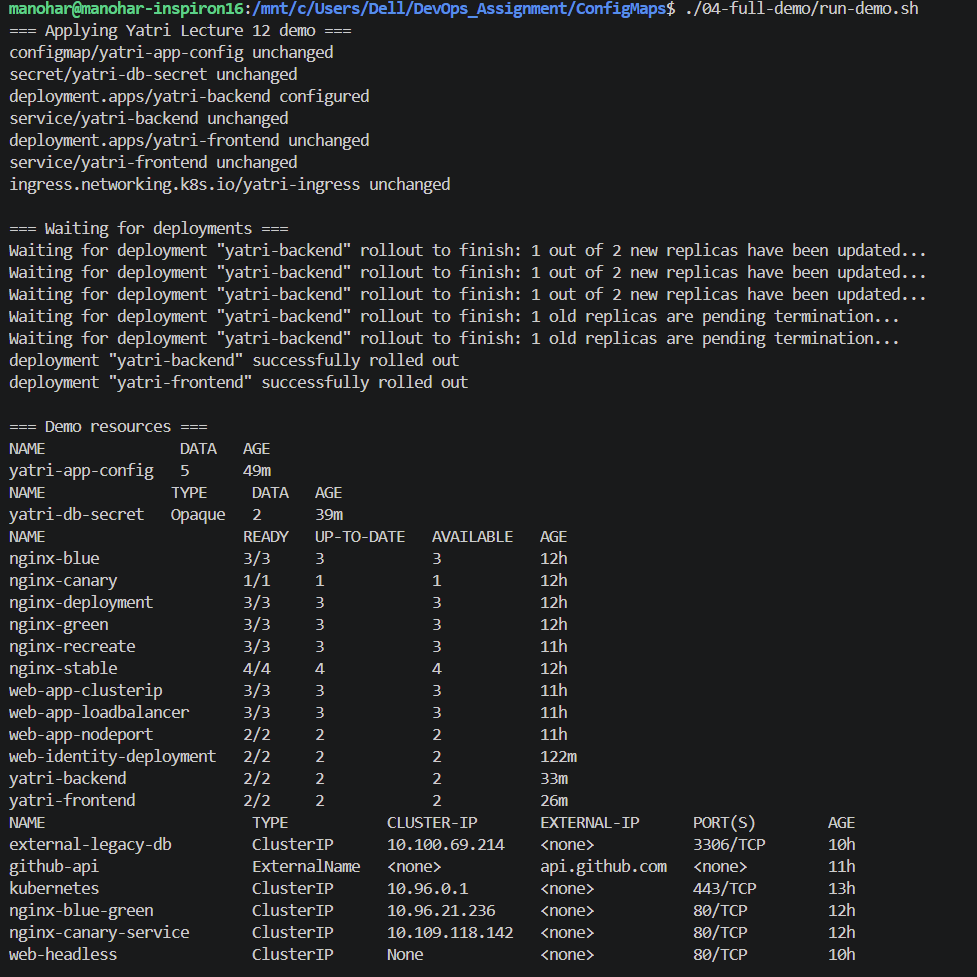

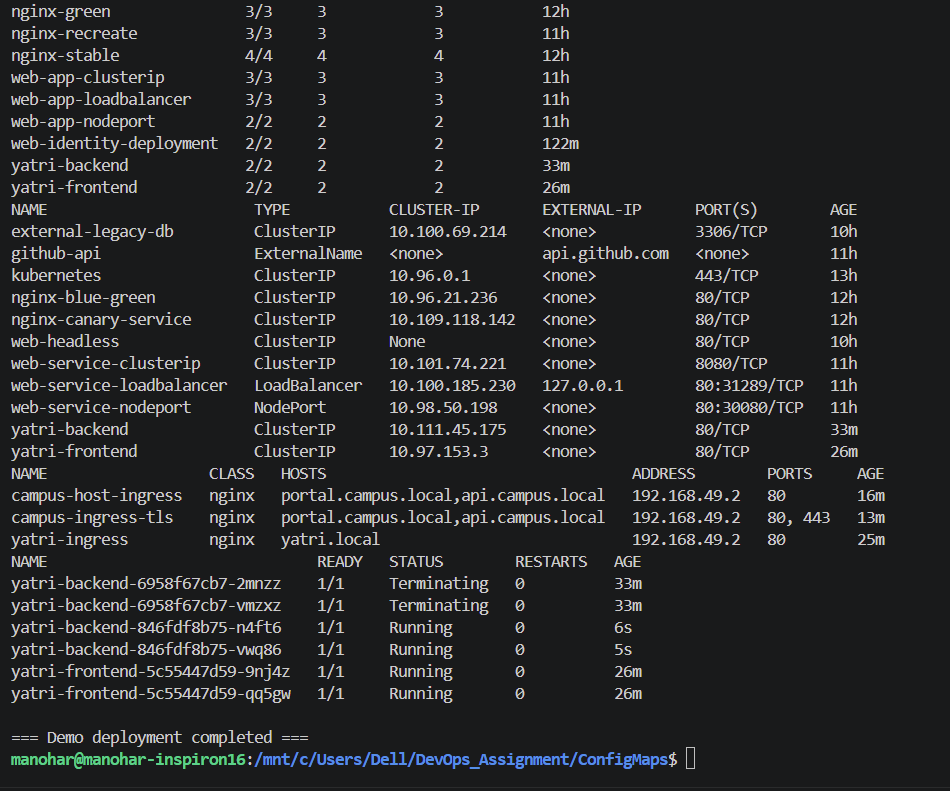

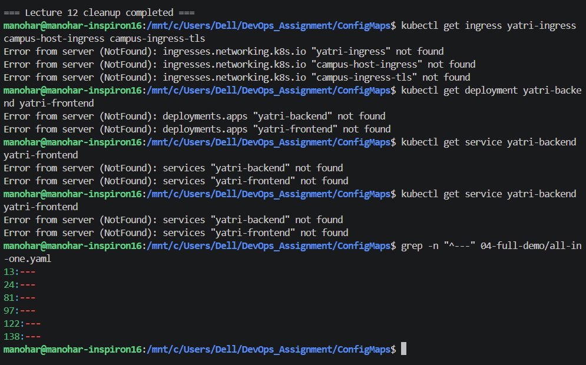

---


### ConfigMap

Stores non-sensitive application configuration separately from container images.

### Secret

Stores sensitive configuration such as credentials. Base64 encoding does not itself provide encryption.

### Ingress Resource

Defines Layer 7 routing rules.

### Ingress Controller

Implements those routing rules and handles actual network traffic.

### Path-Based Routing

Routes traffic based on URL paths.

Example:

```text
example.com/       → frontend
example.com/api/   → backend
```

### Host-Based Routing

Routes traffic based on hostname.

Example:

```text
portal.example.com → frontend
api.example.com    → backend
```

### Hybrid Routing

Combines hostname and path matching.

### TLS Termination

The Ingress Controller handles HTTPS/TLS at the edge and forwards traffic to backend Services.

### Automation

Shell scripts can deploy and clean up multiple Kubernetes resources consistently.
