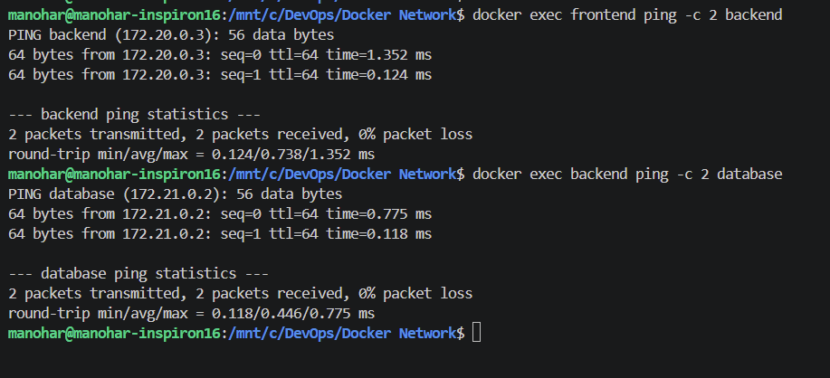
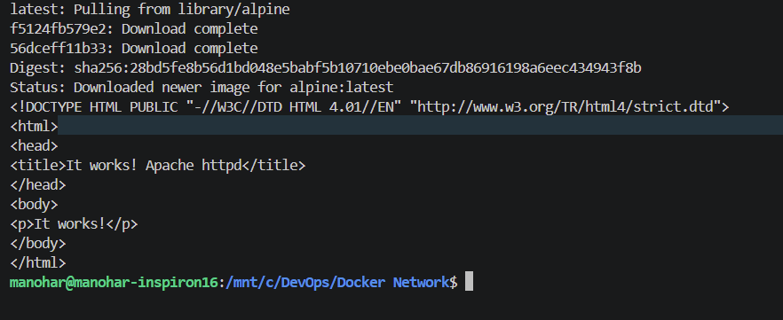
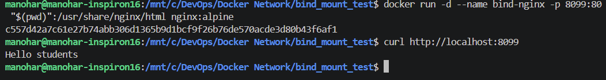

# Docker Networking & Volume Homework

**Name:** Vanukuri Manohar Reddy

**Enrollment Number:** 24bcs10509

## Task 1: Container Networking
Three networks were created. The Backend was successfully bridged between the Frontend and Database.

## Task 2: Host Network

The Apache container was deployed using `--network host`.

## Task 3: Bind Mounts

A local folder was mounted to Nginx. Changes to the `index.html` on the host machine were immediately reflected inside the container without requiring a restart.

## Task 4: Overlay Network Research

*   **What it is:** A Docker overlay network is a distributed network that spans multiple Docker daemon hosts, allowing containers connected to it to communicate securely as if they were on the same physical machine.
*   **Use Cases:** It is primarily used in Docker Swarm or Kubernetes clusters to facilitate seamless communication between microservices spread across a cluster of multiple servers/nodes.
*   **How it works:** It uses VXLAN (Virtual Extensible LAN) technology to encapsulate container network traffic into standard physical network packets, tunneling the traffic between the different hosts securely.