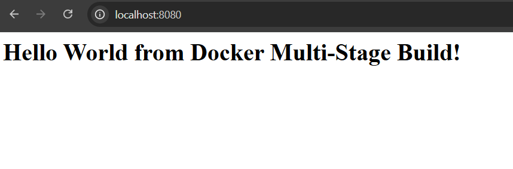
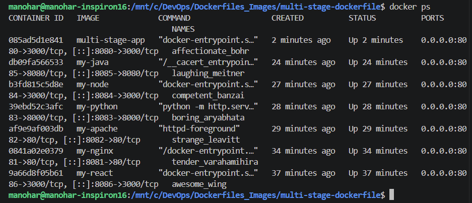
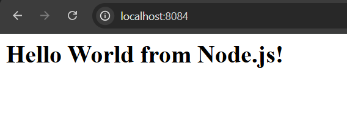
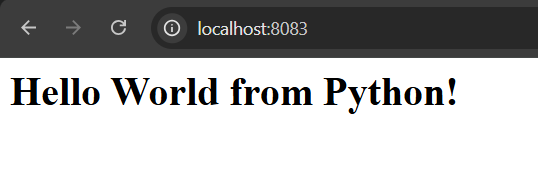
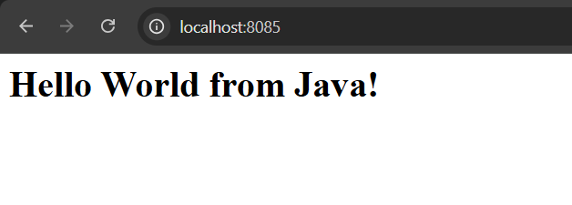

# Docker Multi-Stage Build & Deployment

**Name:** Vanukuri Manohar Reddy
**Enrollment Number:** 24bcs10509

---

## Task 1: Run Multi-Stage Dockerfile
The multi-stage Dockerfile was successfully built and deployed. 

**Webpage Verification:**

 

**Terminal Verification (docker ps):**

---

## Task 3: Docker Application Deployment
To fulfill the requirement of deploying at least 3 different types of applications, the following containers were successfully built and deployed alongside the multi-stage app. (Evidence of deployment is visible in the `docker ps` output above).

**1. Node.js Application**

* **Container Name:** `my-node`
* **Port Mapping:** `8084:3000`
* **Evidence:**

**2. Python Application**

* **Container Name:** `my-python`
* **Port Mapping:** `8083:8000`
* **Evidence:**

**3. Java Application**

* **Container Name:** `my-java`
* **Port Mapping:** `8085:8080`
* **Evidence:**

