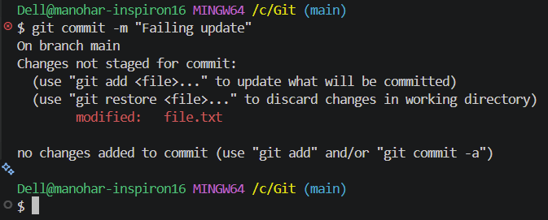
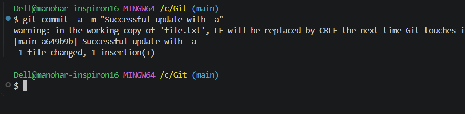
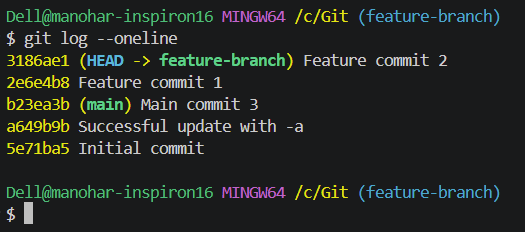
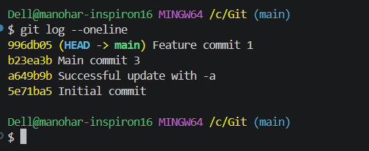

# Git and GitHub Homework

## Task 1: `git commit -m` vs `git commit -a -m`

### Explanation
*   **`git commit -m "message"`**: Commits only the files that have been explicitly staged to the index using `git add`. If a tracked file is modified but not staged, this command will ignore the changes.
*   **`git commit -a -m "message"`**: A shortcut that tells Git to automatically stage all modified and deleted files that are *already being tracked* before committing. (Note: It does not include newly created, untracked files).

### Execution Proof
**Attempting to commit a modified file with just `-m` (Failed because it wasn't staged):**

**Committing the same modified file with `-a -m` (Succeeded by auto-staging):**

---

## Task 2: Git Cherry-Pick

### Explanation
`git cherry-pick` is a powerful command that allows you to apply the changes introduced by one or more specific commits from another branch directly into your current working branch, without merging the entire branch. 

### Execution Proof
**1. Viewing the commits in `feature-branch` to identify the hash for "Feature commit 1":**

**2. Switching to `main`, executing the cherry-pick, and verifying the commit was successfully applied:**

