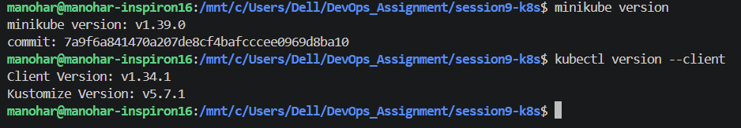
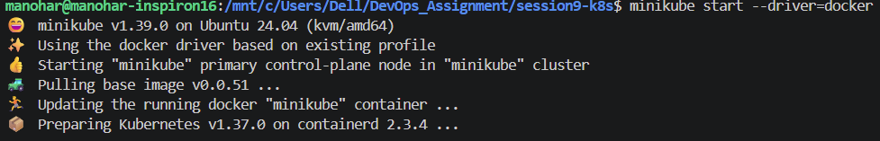
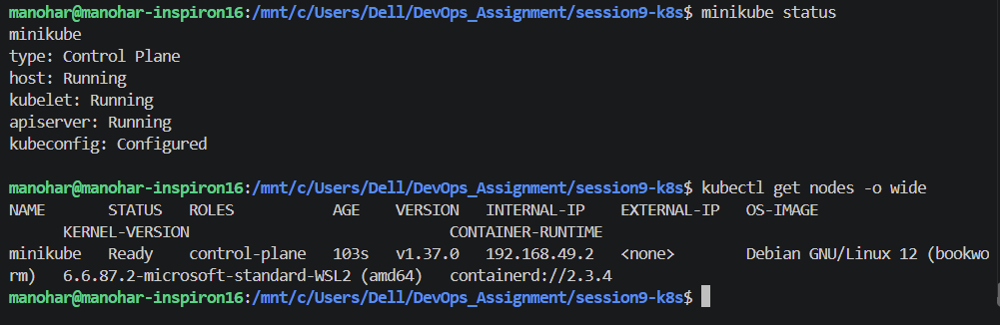
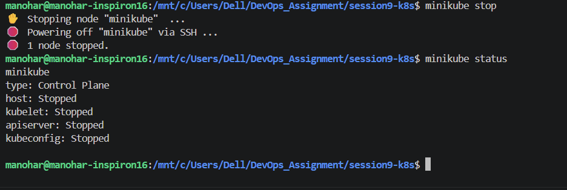

# Session 9: Kubernetes Fundamentals & Cluster Architecture

**Author:** vanukuri manohar reddy

**Course:** SST DevOps & Cloud [SWE]

**Session:** 09 - Kubernetes Fundamentals

---

## Task 1: Minikube & CLI Installation Verification

Verify that Minikube and the Kubernetes CLI (`kubectl`) are successfully installed on the local system.

**Commands:**
```bash
minikube version
kubectl version --client
```

**Output:**

```
minikube version: v1.39.1
commit: 7a9f6a841470a207de8cf4bafcccee0969d8ba10

Client Version: v1.34.1
Kustomize Version: v5.7.1
```

**Screenshot:**



---

## Task 2: Starting the Minikube Kubernetes Cluster

Initialize the local single-node Kubernetes cluster using the containerized runtime environment.

**Command:**

```bash
minikube start
```

**Output:**

```
😄  minikube v1.39.0 on Ubuntu 24.04 (kvm/amd64)
✨  Using the docker driver based on user configuration
📌  Using Docker driver with root privileges
👍  Starting "minikube" primary control-plane node in "minikube" cluster
🚜  Pulling base image v0.0.51 ...
🔥  Creating docker container (CPUs=2, Memory=3072MB) ...
📦  Preparing Kubernetes v1.37.0 on containerd 2.3.4 ...
🔗  Configuring CNI (Container Networking Interface) ...
🔎  Verifying Kubernetes components...
    ▪ Using image gcr.io/k8s-minikube/storage-provisioner:v5
🌟  Enabled addons: storage-provisioner, default-storageclass
🏄  Done! kubectl is now configured to use "minikube" cluster and "default" namespace by default
```

**Screenshot:**



---

## Task 3: Verifying Cluster Status & Node Health

Inspect the status of the local cluster control plane, kubelet, API server, and verify the node is in `Ready` state.

**Commands:**

```bash
minikube status
kubectl get nodes -o wide
```

**Output:**

```
minikube
type: Control Plane
host: Running
kubelet: Running
apiserver: Running
kubeconfig: Configured

NAME       STATUS   ROLES           AGE    VERSION   INTERNAL-IP    EXTERNAL-IP   OS-IMAGE                         KERNEL-VERSION                             CONTAINER-RUNTIME
minikube   Ready    control-plane   103s   v1.37.0   192.168.49.2   <none>        Debian GNU/Linux 12 (bookworm)   6.6.87.2-microsoft-standard-WSL2 (amd64)   containerd://2.3.4
```

**Screenshot:**



---

## Task 4: Stopping the Minikube Cluster

Gracefully power down the Minikube cluster VM/container to release system resources.

**Command:**

```bash
minikube stop
minikube status
```

**Output:**

```
✋  Stopping node "minikube" ...
🛑  Powering off "minikube" via SSH ...
🛑  1 node stopped.

minikube
type: Control Plane
host: Stopped
kubelet: Stopped
apiserver: Stopped
kubeconfig: Configured
```

**Screenshot:**


---

## Task 5: Kubernetes Cluster Architecture & Core Components

Kubernetes uses a **Control Plane** to manage the cluster and **Worker Nodes** to run application workloads.

### 5.1 Control Plane Components

The Control Plane is responsible for managing the overall state of the Kubernetes cluster.

#### kube-apiserver

The **kube-apiserver** is the main entry point for communication with the Kubernetes cluster. Commands such as `kubectl` communicate with Kubernetes through the API server.

#### etcd

**etcd** is a consistent key-value store used by Kubernetes to store cluster state, configuration, metadata, and other Kubernetes objects.

#### kube-scheduler

The **kube-scheduler** selects an appropriate worker node for newly created Pods based on available resources, constraints, and scheduling requirements.

#### kube-controller-manager

The **kube-controller-manager** runs control loops that continuously compare the desired state with the actual state of the cluster and take corrective actions when necessary.

---

### 5.2 Worker Node Components

Worker Nodes are responsible for running the application workloads in the Kubernetes cluster.

#### kubelet

The **kubelet** is the agent running on each worker node. It communicates with the API server and ensures that the containers specified by Pod definitions are running correctly.

#### kube-proxy

**kube-proxy** maintains networking rules that allow Kubernetes Services to route network traffic to the appropriate Pods.

#### Container Runtime

The **Container Runtime** is responsible for running containers. Kubernetes commonly works with runtimes such as **containerd** and **CRI-O** through the Container Runtime Interface (CRI).

#### Pod

A **Pod** is the smallest deployable unit in Kubernetes. It contains one or more containers that share networking and storage resources.

---

### 5.3 Component Interaction

The basic interaction between the user, Control Plane, and Worker Node can be represented as follows:

```text
                         User / kubectl
                               |
                               v
                        kube-apiserver
                         /     |      \
                        /      |       \
                       v       v        v
                    etcd   scheduler  controller-manager
                               |
                               v
                         Worker Node
                               |
              +----------------+----------------+
              |                |                |
              v                v                v
           kubelet         kube-proxy     Container Runtime
                                                 |
                                                 v
                                                Pod
```

### 5.4 How the Components Work Together

1. The user interacts with the Kubernetes cluster using `kubectl`.
2. `kubectl` sends requests to the **kube-apiserver**.
3. The API server communicates with **etcd** to store and retrieve cluster state.
4. The **kube-scheduler** determines which worker node should run newly created Pods.
5. The **kube-controller-manager** continuously works to maintain the desired state of the cluster.
6. The **kubelet** on the selected worker node ensures that the required Pods and containers are running.
7. The **container runtime** runs the containers inside the Pods.
8. **kube-proxy** helps provide networking and Service-to-Pod traffic routing.

### 5.5 Summary

The **Control Plane** manages the desired state and overall operation of the Kubernetes cluster, while **Worker Nodes** run the actual application workloads.

The **kube-apiserver** acts as the main communication point, **etcd** stores cluster state, the **scheduler** assigns workloads to nodes, and the **controller manager** maintains the desired state. On worker nodes, **kubelet**, **kube-proxy**, and the **container runtime** work together to run and connect application Pods.
