**Author:** vanukuri manohar reddy

**Course:** SST DevOps & Cloud [SWE]


# Lecture 11 — Kubernetes Services, Networking & Workload Identity

## Overview

This lecture focuses on Kubernetes networking, Service types, DNS/CoreDNS, workload identity, and production-oriented Service selection.

# Task 1 — Kubernetes Port Architecture

## Port Definitions

| Port            | Purpose                                                           |
| --------------- | ----------------------------------------------------------------- |
| `containerPort` | Documents the port on which the containerized application listens |
| `targetPort`    | Service forwards traffic to this port on the selected Pod         |
| `port`          | Port exposed by the Kubernetes Service                            |
| `nodePort`      | Port opened on each cluster node for NodePort Services            |

### Traffic Flow

```text
External Client
      |
      v
[nodePort: 30080]
      |
      v
[Service port: 8080]
      |
      v
[targetPort: 80]
      |
      v
[containerPort: 80]
      |
      v
Nginx Application
```

### Commands

```bash
kubectl explain pod.spec.containers.ports.containerPort
kubectl explain service.spec.ports
```

### Screenshot

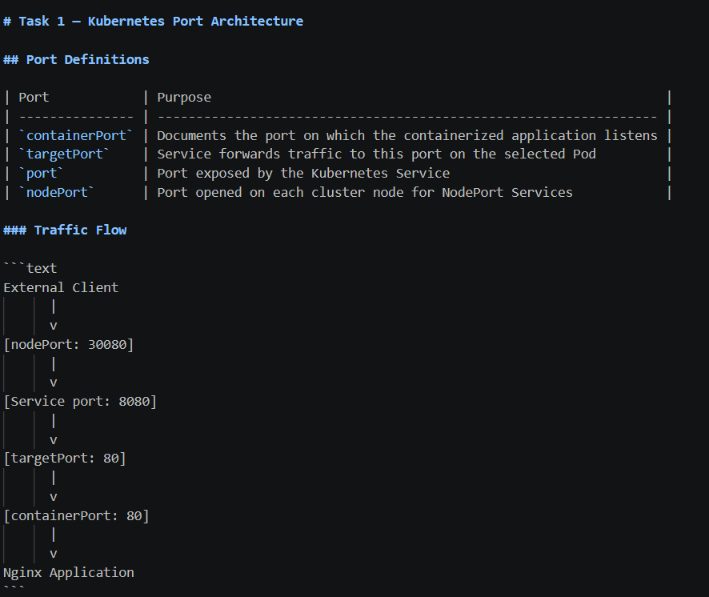

---

# Task 2 — ClusterIP Service

## Objective

Deploy a 3-replica Nginx backend and expose it internally using the default `ClusterIP` Service.

### Working Directory

```text
01-clusterip/
```

### Files

```text
01-clusterip/
├── app-deployment.yaml
├── service.yaml
└── client-pod.yaml
```

### Apply Resources

```bash
kubectl apply -f 01-clusterip/app-deployment.yaml
kubectl apply -f 01-clusterip/service.yaml
```

### Verify Pods

```bash
kubectl get pods -l app=web-clusterip -o wide
```

### Verify Service

```bash
kubectl get svc web-service-clusterip
```

### Verify Endpoints

```bash
kubectl get endpoints web-service-clusterip
kubectl get endpointslice -l kubernetes.io/service-name=web-service-clusterip
```

### Deploy Client

```bash
kubectl apply -f 01-clusterip/client-pod.yaml
kubectl wait --for=condition=ready pod/curl-client --timeout=60s
```

### Test Using Service Name

```bash
kubectl exec -it curl-client -- curl -s http://web-service-clusterip:8080 | grep -i "<title>"
```

### Test Using FQDN

```bash
kubectl exec -it curl-client -- curl -s http://web-service-clusterip.default.svc.cluster.local:8080 | grep -i "<title>"
```

### Expected Result

```text
<title>Thank you for using nginx.</title>
```

### Screenshots

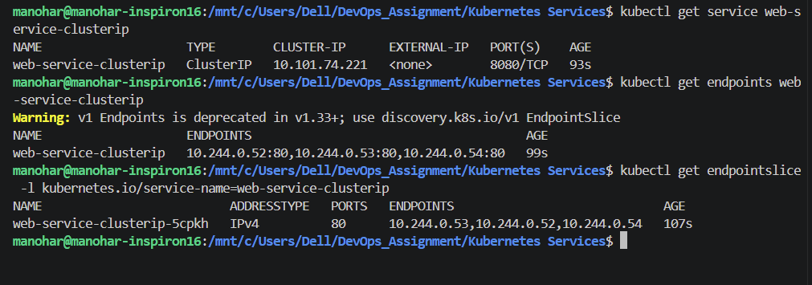

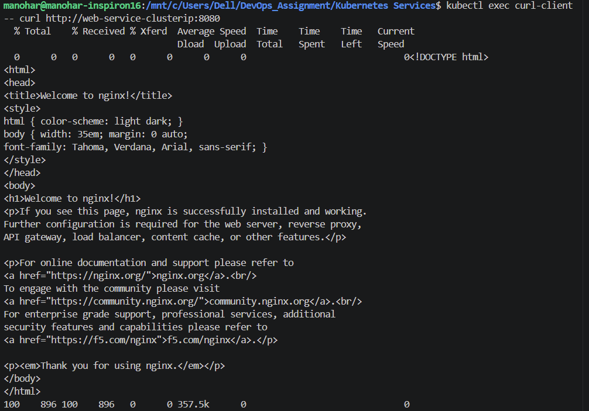

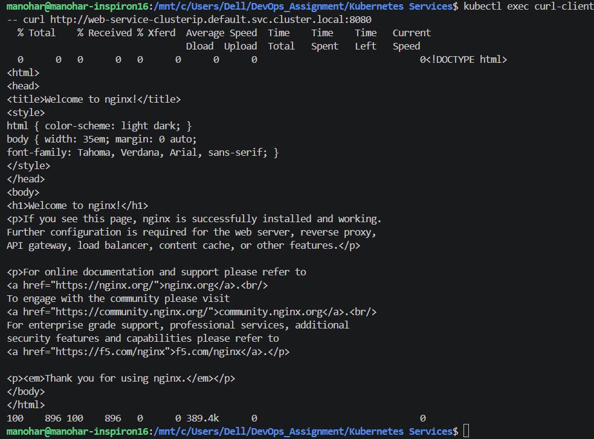

---

# Task 3 — NodePort Service

## Objective

Expose an Nginx application using NodePort `30080`.

### Working Directory

```text
02-nodeport/
```

### Files

```text
02-nodeport/
├── app-deployment.yaml
└── service.yaml
```

### Apply

```bash
kubectl apply -f 02-nodeport/app-deployment.yaml
kubectl apply -f 02-nodeport/service.yaml
```

### Verify Service

```bash
kubectl get svc web-service-nodeport
```

Expected mapping:

```text
80:30080/TCP
```

### Get Minikube IP

```bash
minikube ip
```

### Test NodePort

```bash
NODE_IP=$(minikube ip)
curl -I http://$NODE_IP:30080
```

If direct Node-IP access is unavailable with the Docker driver, use:

```bash
minikube service web-service-nodeport --url
```

### Screenshots

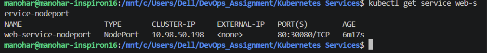

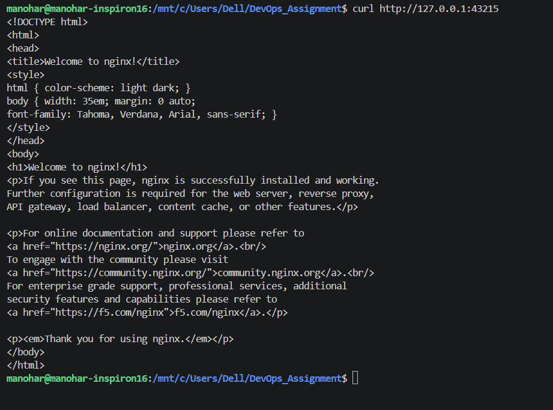

---

# Task 4 — LoadBalancer Service

## Objective

Use a `LoadBalancer` Service and Minikube's tunnel mechanism to simulate cloud LoadBalancer behavior.

### Working Directory

```text
03-loadbalancer/
```

### Apply

```bash
kubectl apply -f 03-loadbalancer/app-deployment.yaml
kubectl apply -f 03-loadbalancer/service.yaml
```

### Check Initial State

```bash
kubectl get svc web-service-loadbalancer
```

The external IP may initially show:

```text
<pending>
```

### Start Minikube Tunnel

Open a **second WSL terminal** and run:

```bash
minikube tunnel
```

Keep this terminal running.

In the first terminal:

```bash
kubectl get svc web-service-loadbalancer
```

### Inspect Service Ports

```bash
kubectl describe svc web-service-loadbalancer
```

A LoadBalancer Service also has an underlying ClusterIP and NodePort.

### Test Access

Use the external IP assigned by Minikube:

```bash
EXTERNAL_IP=$(kubectl get svc web-service-loadbalancer -o jsonpath='{.status.loadBalancer.ingress[0].ip}')
echo $EXTERNAL_IP
```

Then:

```bash
curl -s http://$EXTERNAL_IP:80 | grep -i "<title>"
```

### Screenshots

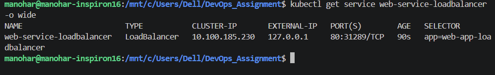

---

# Task 5 — ExternalName Service

## Objective

Create an `ExternalName` Service that acts as a DNS CNAME alias for an external domain.

### Working Directory

```text
04-externalname/
```

### Files

```text
04-externalname/
├── service.yaml
└── client-pod.yaml
```

### Apply

```bash
kubectl apply -f 04-externalname/service.yaml
kubectl apply -f 04-externalname/client-pod.yaml
kubectl wait --for=condition=ready pod/dns-test-client --timeout=60s
```

### Inspect Service

```bash
kubectl get svc external-database-service
```

Expected:

```text
TYPE: ExternalName
CLUSTER-IP: <none>
```

### DNS Test

```bash
kubectl exec -it dns-test-client -- nslookup external-database-service
```

The result should show the configured external domain as the canonical name.

### Screenshots

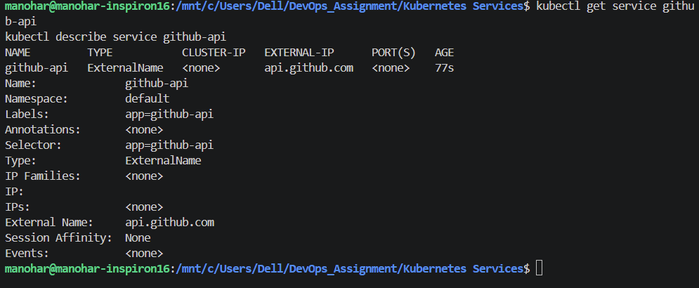

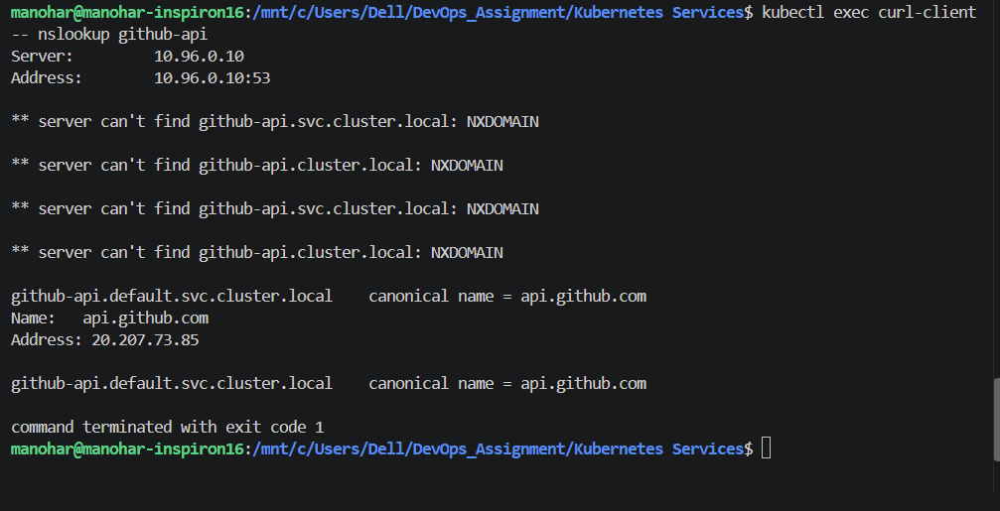

---

# Task 6 — Headless Service + StatefulSet

## Objective

Demonstrate a Headless Service using:

```yaml
clusterIP: None
```

Unlike a normal ClusterIP Service, a Headless Service does not provide one virtual IP. DNS can return the individual Pod IPs.

### Working Directory

```text
05-headless/
```

### Files

```text
05-headless/
├── service.yaml
├── app-statefulset.yaml
└── client-pod.yaml
```

### Apply

```bash
kubectl apply -f 05-headless/service.yaml
kubectl apply -f 05-headless/app-statefulset.yaml
kubectl apply -f 05-headless/client-pod.yaml
```

### Wait for StatefulSet

```bash
kubectl rollout status statefulset/web-stateful --timeout=120s
```

### Verify Pods

```bash
kubectl get pods -l app=web-headless -o wide
```

Expected:

```text
web-stateful-0
web-stateful-1
web-stateful-2
```

### Verify Headless Service

```bash
kubectl get svc web-service-headless
```

Expected:

```text
CLUSTER-IP   None
```

### DNS Lookup

```bash
kubectl exec -it headless-dns-client -- nslookup web-service-headless
```

Multiple Pod IP addresses should be returned.

### Individual Stateful Pod DNS

```bash
kubectl exec -it headless-dns-client -- nslookup web-stateful-0.web-service-headless.default.svc.cluster.local
```

### Direct Access

```bash
kubectl exec -it headless-dns-client -- curl -s http://web-stateful-0.web-service-headless:80 | grep -i "<title>"
```

### Screenshots

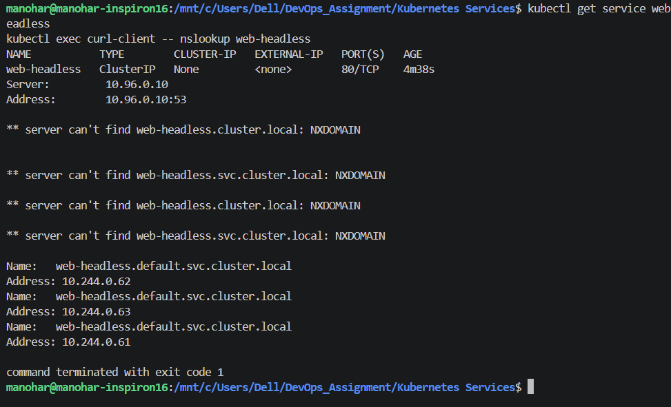

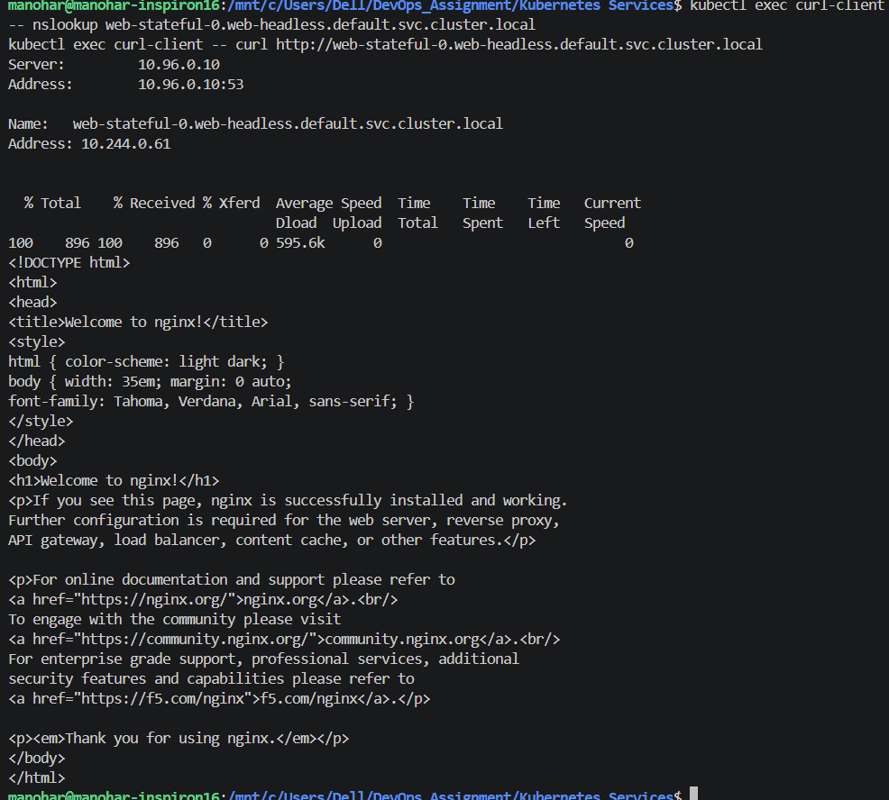

---

# Task 7 — Service Without Selector

## Objective

Create a Service without a selector and manually associate an external backend through an Endpoints object.

### Create Service

```bash
cat <<EOF | kubectl apply -f -
apiVersion: v1
kind: Service
metadata:
  name: external-legacy-db
spec:
  ports:
    - protocol: TCP
      port: 3306
      targetPort: 3306
EOF
```

### Verify Empty Endpoints

```bash
kubectl get endpoints external-legacy-db
```

Initially there should be no manually configured endpoint.

### Create Manual Endpoint

```bash
cat <<EOF | kubectl apply -f -
apiVersion: v1
kind: Endpoints
metadata:
  name: external-legacy-db
subsets:
  - addresses:
      - ip: 192.168.1.150
    ports:
      - port: 3306
EOF
```

### Verify

```bash
kubectl get endpoints external-legacy-db
```

Expected:

```text
192.168.1.150:3306
```

> Note: The example IP is for demonstrating manual endpoint mapping. It does not need to be a reachable database in this lab.

### Screenshots

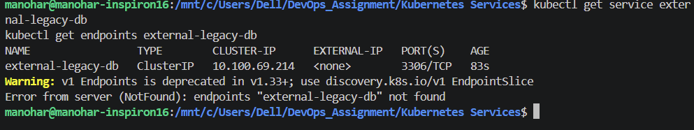

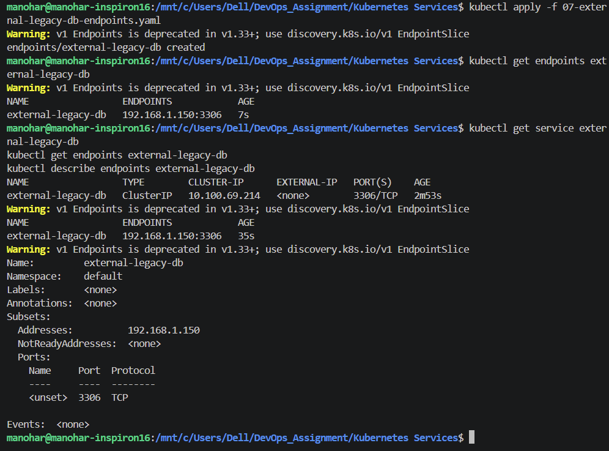

---

# Task 8 — FQDN & CoreDNS

## Kubernetes FQDN

The standard Kubernetes Service FQDN is:

```text
<service>.<namespace>.svc.cluster.local
```

Example:

```text
web-service-clusterip.default.svc.cluster.local
```

### Check CoreDNS

```bash
kubectl get pods -n kube-system -l k8s-app=kube-dns -o wide
```

### Inspect DNS Configuration

```bash
kubectl exec -it curl-client -- cat /etc/resolv.conf
```

Important fields include:

```text
nameserver
search
options ndots:5
```

### Test Short Name

```bash
kubectl exec -it curl-client -- nslookup web-service-clusterip
```

### Test Full FQDN

```bash
kubectl exec -it curl-client -- nslookup web-service-clusterip.default.svc.cluster.local
```

### `ndots:5`

With `ndots:5`, names containing fewer than five dots can be tried through the configured search domains before being treated as fully qualified.

For external API calls, this can result in additional DNS queries and therefore additional DNS latency.

### Screenshots

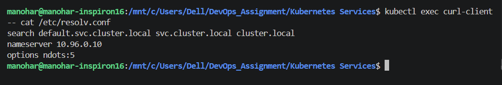

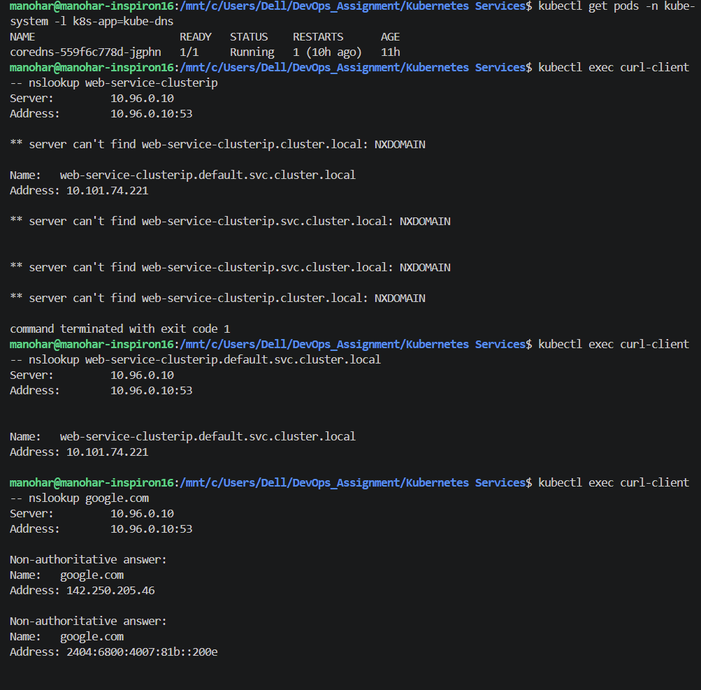

---

# Task 9 — Pod Identity: Deployment vs StatefulSet

## Objective

Compare the identity behavior of stateless Deployments and StatefulSets.

### Deploy Workloads

```bash
kubectl apply -f 01-clusterip/app-deployment.yaml
kubectl apply -f 05-headless/service.yaml
kubectl apply -f 05-headless/app-statefulset.yaml
```

### Inspect Names

```bash
kubectl get pods -l app=web-clusterip
kubectl get pods -l app=web-headless
```

Deployment Pods have generated names similar to:

```text
web-app-clusterip-xxxxx-yyyyy
```

StatefulSet Pods have deterministic ordinal names:

```text
web-stateful-0
web-stateful-1
web-stateful-2
```

### Delete a Deployment Pod

```bash
DEPLOY_POD=$(kubectl get pods -l app=web-clusterip -o jsonpath='{.items[0].metadata.name}')
echo "Deleting Deployment Pod: ${DEPLOY_POD}"
kubectl delete pod "${DEPLOY_POD}"
```

Then:

```bash
kubectl get pods -l app=web-clusterip
```

A new Pod with a different generated identity should appear.

### Delete StatefulSet Pod

```bash
echo "Deleting StatefulSet Pod: web-stateful-0"
kubectl delete pod web-stateful-0
```

Then:

```bash
kubectl get pods -l app=web-headless
```

The StatefulSet recreates:

```text
web-stateful-0
```

### Screenshots

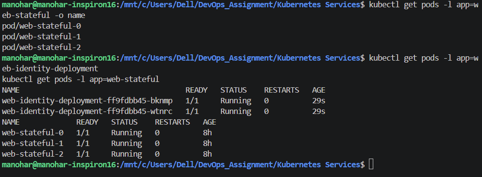

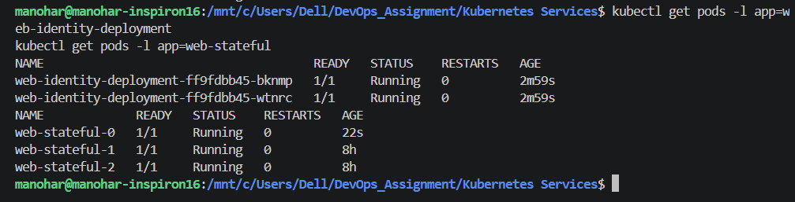

---

# Task 10 — Deployment vs StatefulSet vs DaemonSet

## Architectural Comparison

| Architectural Metric | Deployment                          | StatefulSet                         | DaemonSet                          |
| -------------------- | ----------------------------------- | ----------------------------------- | ---------------------------------- |
| Primary Workload     | Stateless applications              | Stateful applications               | Node-level agents                  |
| Pod Naming           | Generated names                     | Ordered ordinal names               | Generated names                    |
| Identity             | Disposable                          | Stable identity                     | Associated with node               |
| Startup              | Generally parallel                  | Ordered                             | Across eligible nodes              |
| Storage              | Ephemeral/shared volumes            | Per-Pod persistent storage possible | Node-local/host storage common     |
| Common Service       | ClusterIP / NodePort / LoadBalancer | Often Headless Service              | Depends on workload                |
| Scaling              | Replica count                       | Ordered replicas                    | Based on eligible nodes            |
| Production Examples  | Nginx, APIs, web services           | Databases, Kafka, Cassandra         | Node Exporter, Fluentd, CNI agents |

### Schema Inspection

```bash
kubectl explain deployment.spec
kubectl explain statefulset.spec
kubectl explain daemonset.spec
```

### Screenshot

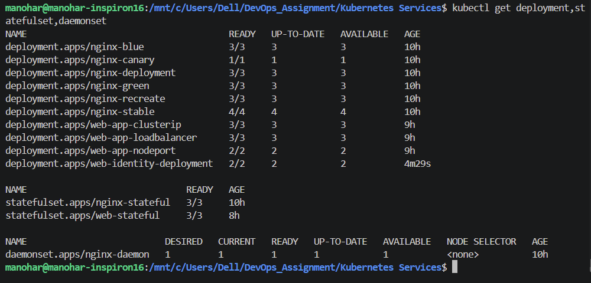

---

# Task 11 — Service Selection & Cost Optimization

## Service Decision Tree

```text
Need to expose service outside the cluster?
│
├── NO
│   │
│   ├── Need direct Pod discovery?
│   │      ├── YES → Headless Service
│   │      └── NO  → ClusterIP
│   │
│   └──
│
└── YES
    │
    ├── External third-party DNS target?
    │      └── YES → ExternalName
    │
    └── NO
         │
         ├── HTTP/HTTPS on public cloud
         │      └── Ingress + LoadBalancer entrypoint
         │
         ├── Direct TCP/UDP exposure
         │      └── LoadBalancer
         │
         └── Development/on-prem exposure
                └── NodePort
```

## LoadBalancer Cost Model

Provisioning many separate cloud LoadBalancer Services can create additional infrastructure and billing overhead.

Example illustrative model:

```text
50 LoadBalancer Services × $25/month
= $1,250/month
```

A unified ingress architecture can instead use:

```text
Internet
   |
   v
One Cloud Load Balancer
   |
   v
Ingress Controller
   |
   +---- ClusterIP Service A
   +---- ClusterIP Service B
   +---- ClusterIP Service C
   +---- ...
```

The exact cloud-provider pricing varies by provider, region, configuration, traffic, and additional resources, so the `$25/month` figure is an **illustrative assumption**, not a universal cloud price.

---

# Task 12 — Minikube Docker Driver Networking

## Problem

With the Docker driver, Minikube runs its Kubernetes node inside a Docker container/network.

Therefore, depending on the host OS and networking configuration, directly accessing:

```text
<Node-IP>:<NodePort>
```

may not work from the host.

### Verify NodePort

```bash
kubectl get svc web-service-nodeport
```

### Get Node IP

```bash
NODE_IP=$(minikube ip)
echo "Minikube Node IP: $NODE_IP"
```

### Test Direct Access

```bash
curl --connect-timeout 2 -I http://$NODE_IP:30080 || echo "Direct NodePort connection failed"
```

The result depends on the host/WSL/Docker networking configuration.

## Workaround 1 — Minikube Service

Run:

```bash
minikube service web-service-nodeport --url
```

Minikube provides a host-accessible URL.

Test the returned URL:

```bash
curl -I <URL_RETURNED_BY_MINIKUBE>
```

Expected:

```text
HTTP/1.1 200 OK
```

## Workaround 2 — Minikube Tunnel

For LoadBalancer networking, run in a separate terminal:

```bash
minikube tunnel
```

Then inspect:

```bash
kubectl get svc
```

The LoadBalancer Service can receive an external IP through the tunnel.

### Screenshots

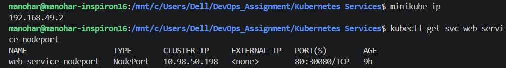

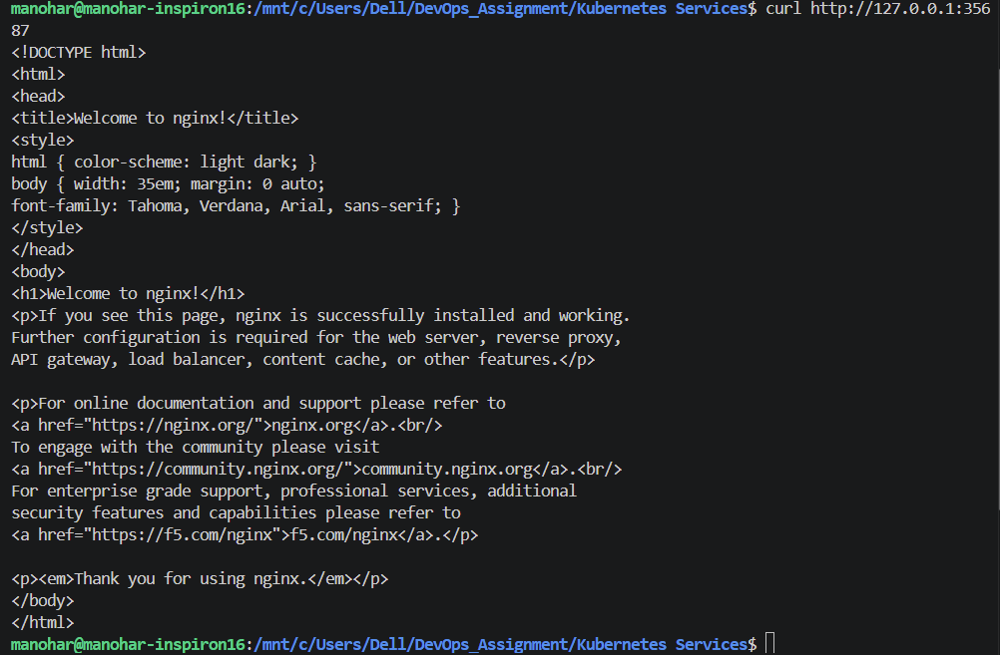
---
