# Session 10: Kubernetes Workloads, Controllers & Troubleshooting

**Author:** Vanukuri Manohar Reddy

**Course:** SST DevOps & Cloud [SWE]

**Session:** 10 - Kubernetes Workloads, Controllers & Troubleshooting

---

## Task 1: Cluster Health Verification

### Description

Verified that the Minikube Kubernetes cluster is running correctly and that the Kubernetes nodes and system Pods are healthy.

### Commands

```bash
minikube status
kubectl get nodes -o wide
kubectl get pods -A
```

### Output

```text
minikube
type: Control Plane
host: Running
kubelet: Running
apiserver: Running
kubeconfig: Configured

NAME       STATUS   ROLES           AGE   VERSION   INTERNAL-IP    EXTERNAL-IP   OS-IMAGE                         KERNEL-VERSION                             CONTAINER-RUNTIME
minikube   Ready    control-plane   20m   v1.37.0   192.168.49.2   <none>        Debian GNU/Linux 12 (bookworm)   6.6.87.2-microsoft-standard-WSL2 (amd64)   containerd://2.3.4

NAMESPACE     NAME                               READY   STATUS    RESTARTS      AGE
kube-system   coredns-559f6c778d-jgphn           1/1     Running   1 (58s ago)   20m
kube-system   etcd-minikube                      1/1     Running   1 (58s ago)   21m
kube-system   kindnet-sj99z                      1/1     Running   1 (58s ago)   20m
kube-system   kube-apiserver-minikube            1/1     Running   1 (58s ago)   21m
kube-system   kube-controller-manager-minikube   1/1     Running   1 (58s ago)   21m
kube-system   kube-proxy-cqg95                   1/1     Running   1 (58s ago)   20m
kube-system   kube-scheduler-minikube            1/1     Running   1 (58s ago)   21m
kube-system   storage-provisioner                1/1     Running   2 (29s ago)   20m
```

### Screenshot

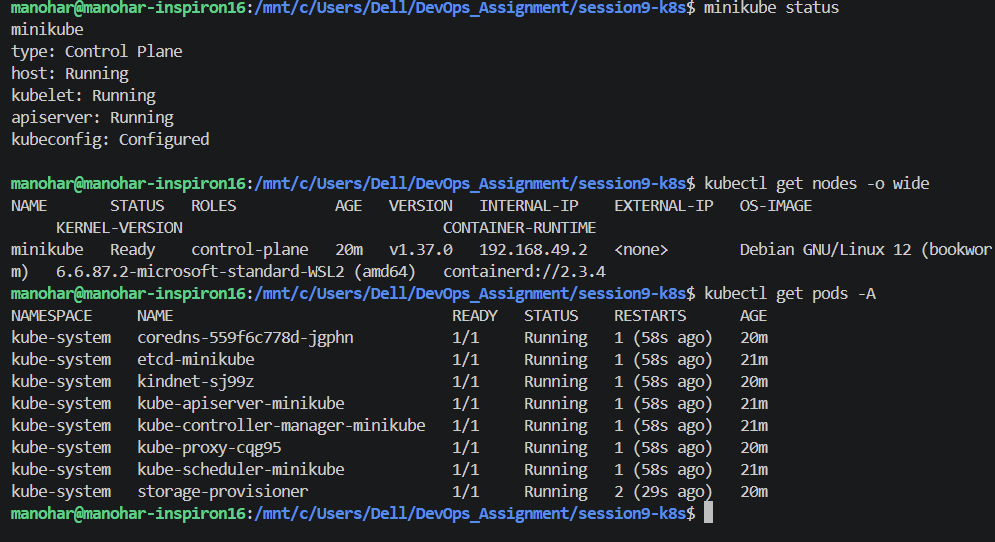

---

## Task 2: Deploying and Inspecting an NGINX Pod

### Description

Created an NGINX Pod using the `kubectl run` command and inspected its status, details, and container information.

### Commands

```bash
kubectl run nginx --image=nginx
kubectl get pods
kubectl describe pod nginx
```

### Output

```text
NAME    READY   STATUS    RESTARTS   AGE
nginx   1/1     Running   0          60s
```

### Screenshot

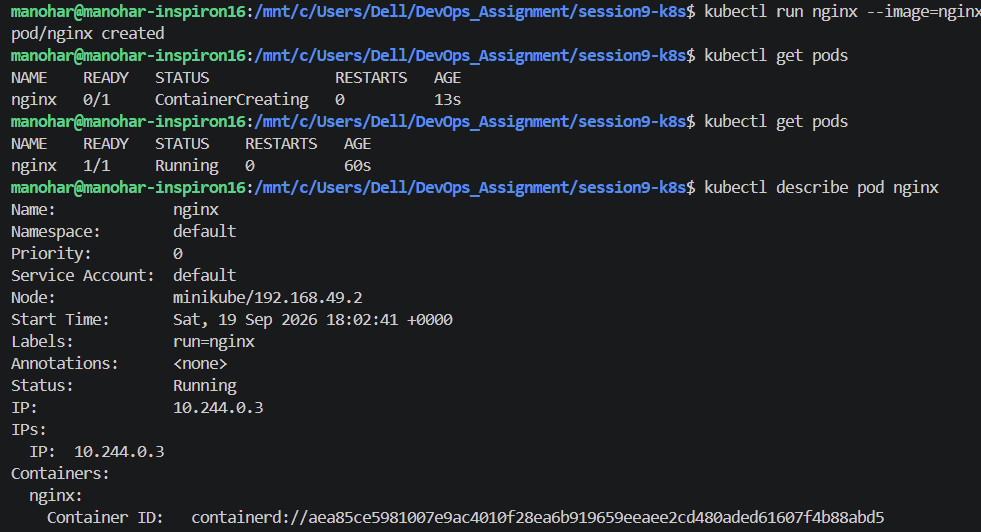

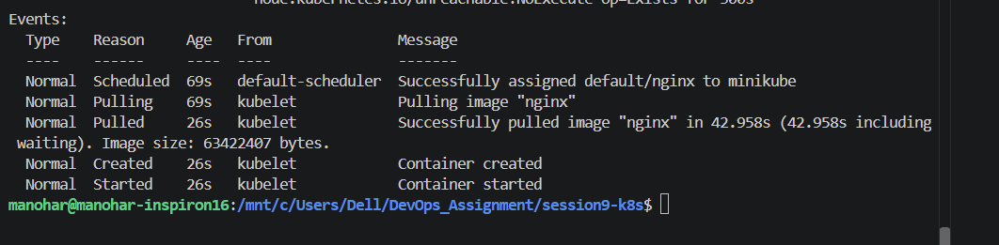

---

## Task 3: Investigating ErrImagePull and ImagePullBackOff

### Description

Created a Pod using an invalid container image to observe Kubernetes image-pull failure states and investigated the reason for the failure.

### Commands

```bash
kubectl run bad-nginx --image=nginx:invalid
kubectl get pod bad-nginx
kubectl describe pod bad-nginx
```

### Output

```text
NAME        READY   STATUS         RESTARTS   AGE
bad-nginx   0/1     ErrImagePull   0          10s
```

### Explanation

When Kubernetes cannot pull the specified container image, the Pod can enter the `ErrImagePull` state. Kubernetes then retries the image pull with an increasing delay, which can result in the `ImagePullBackOff` state.

The `describe` command provides detailed information about the failure, including Events that explain why the image could not be pulled.

### Screenshot

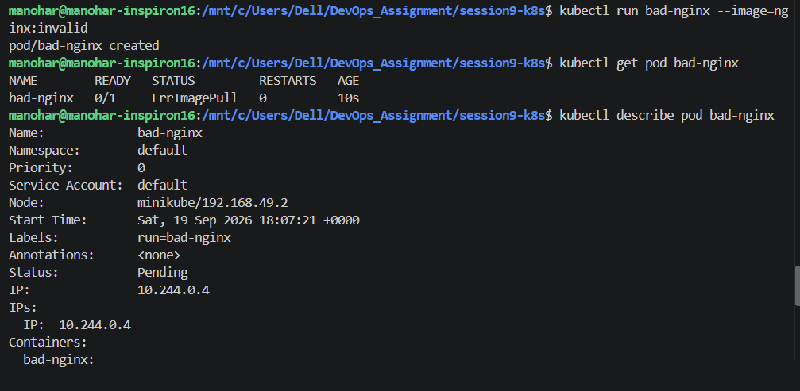

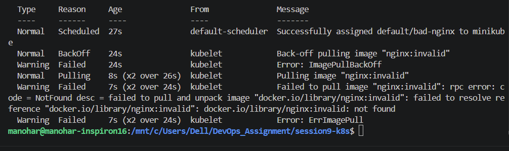
---

## Task 4: Observing Pod Lifecycle States

### Description

Created a temporary Pod and observed how a Pod progresses through different lifecycle states during scheduling, container startup, execution, and completion.

### Commands

```bash
kubectl run lifecycle-demo --image=busybox --restart=Never -- /bin/sh -c "echo Starting; sleep 5; echo Completed"
kubectl get pod lifecycle-demo -w
kubectl get pod lifecycle-demo
```

### Output

```text
NAME             READY   STATUS    RESTARTS   AGE
lifecycle-demo   1/1     Running   0          11s
lifecycle-demo   0/1     Completed   0          14s
lifecycle-demo   0/1     Completed   0          15s

NAME             READY   STATUS      RESTARTS   AGE
lifecycle-demo   0/1     Completed   0          42s

Starting
Completed
```

### Lifecycle Explanation

A Pod can pass through several phases during its lifetime:

* `Pending` - The Pod has been accepted by Kubernetes but has not yet started running.
* `Running` - The Pod has been scheduled and at least one container is running.
* `Succeeded` - All containers completed successfully.
* `Failed` - One or more containers terminated unsuccessfully.
* `Unknown` - The state of the Pod could not be determined.

### Screenshot

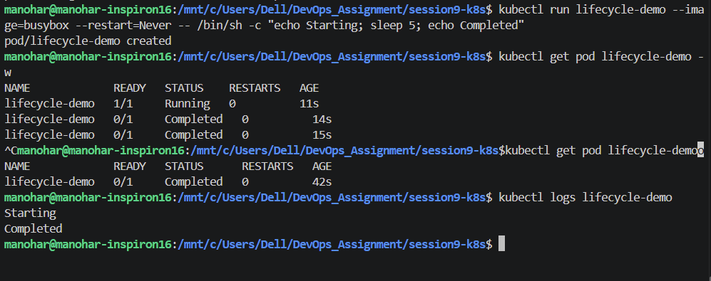

---

## Task 5: Kubernetes Pod Lifecycle Manifests

### Description

Created Kubernetes manifests demonstrating different Pod lifecycle and container restart behaviors.

### Manifest 1: Running Pod

```yaml
apiVersion: v1
kind: Pod
metadata:
  name: lifecycle-running
spec:
  containers:
    - name: nginx
      image: nginx
```

### Manifest 2: Completed Pod

```yaml
apiVersion: v1
kind: Pod
metadata:
  name: lifecycle-completed
spec:
  restartPolicy: Never
  containers:
    - name: busybox
      image: busybox
      command: ["sh", "-c", "echo Job completed"]
```

### Manifest 3: Failed Pod

```yaml
apiVersion: v1
kind: Pod
metadata:
  name: lifecycle-failed
spec:
  restartPolicy: Never
  containers:
    - name: busybox
      image: busybox
      command: ["sh", "-c", "exit 1"]
```

### Manifest 4: CrashLoopBackOff

```yaml
apiVersion: v1
kind: Pod
metadata:
  name: lifecycle-crashloop
spec:
  containers:
    - name: busybox
      image: busybox
      command: ["sh", "-c", "exit 1"]
```

### Manifest 5: Restart Always

```yaml
apiVersion: v1
kind: Pod
metadata:
  name: lifecycle-restart
spec:
  containers:
    - name: busybox
      image: busybox
      command: ["sh", "-c", "echo Restarting; exit 1"]
```

### Manifest 6: Sleeping Pod

```yaml
apiVersion: v1
kind: Pod
metadata:
  name: lifecycle-sleep
spec:
  containers:
    - name: busybox
      image: busybox
      command: ["sh", "-c", "sleep 3600"]
```

### Manifest 7: Multi-Container Pod

```yaml
apiVersion: v1
kind: Pod
metadata:
  name: lifecycle-multi
spec:
  containers:
    - name: nginx
      image: nginx
    - name: sidecar
      image: busybox
      command: ["sh", "-c", "sleep 3600"]
```

### Manifest 8: Readiness Probe

```yaml
apiVersion: v1
kind: Pod
metadata:
  name: lifecycle-readiness
spec:
  containers:
    - name: nginx
      image: nginx
      readinessProbe:
        httpGet:
          path: /
          port: 80
        initialDelaySeconds: 5
        periodSeconds: 5
```

### Manifest 9: Liveness Probe

```yaml
apiVersion: v1
kind: Pod
metadata:
  name: lifecycle-liveness
spec:
  containers:
    - name: nginx
      image: nginx
      livenessProbe:
        httpGet:
          path: /
          port: 80
        initialDelaySeconds: 10
        periodSeconds: 10
```

### Manifest 10: Resource Requests and Limits

```yaml
apiVersion: v1
kind: Pod
metadata:
  name: lifecycle-resources
spec:
  containers:
    - name: nginx
      image: nginx
      resources:
        requests:
          cpu: "100m"
          memory: "64Mi"
        limits:
          cpu: "250m"
          memory: "128Mi"
```

### Manifest 11: Environment Variables

```yaml
apiVersion: v1
kind: Pod
metadata:
  name: lifecycle-env
spec:
  containers:
    - name: nginx
      image: nginx
      env:
        - name: APP_ENV
          value: "development"
```

### Manifest 12: Pod with Custom Command

```yaml
apiVersion: v1
kind: Pod
metadata:
  name: lifecycle-command
spec:
  restartPolicy: Never
  containers:
    - name: busybox
      image: busybox
      command: ["sh", "-c"]
      args:
        - |
          echo "Custom command started"
          sleep 10
          echo "Custom command completed"
```

### Commands

```bash
kubectl apply -f <manifest-file>
kubectl get pods
kubectl describe pod <pod-name>
```

### Output

```text
NAME                  READY   STATUS             RESTARTS      AGE
lifecycle-command     0/1     Completed          0             72s
lifecycle-completed   0/1     Completed          0             66s
lifecycle-crashloop   0/1     Error              3 (42s ago)   60s
lifecycle-demo        0/1     Completed          0             16m
lifecycle-env         1/1     Running            0             52s
lifecycle-failed      0/1     Error              0             47s
lifecycle-liveness    1/1     Running            0             39s
lifecycle-multi       2/2     Running            0             34s
lifecycle-readiness   1/1     Running            0             27s
lifecycle-resources   1/1     Running            0             22s
lifecycle-restart     0/1     CrashLoopBackOff   1 (9s ago)    16s
lifecycle-running     1/1     Running            0             10s
lifecycle-sleep       1/1     Running            0             5s
nginx                 1/1     Running            0             24m
```

### Screenshot

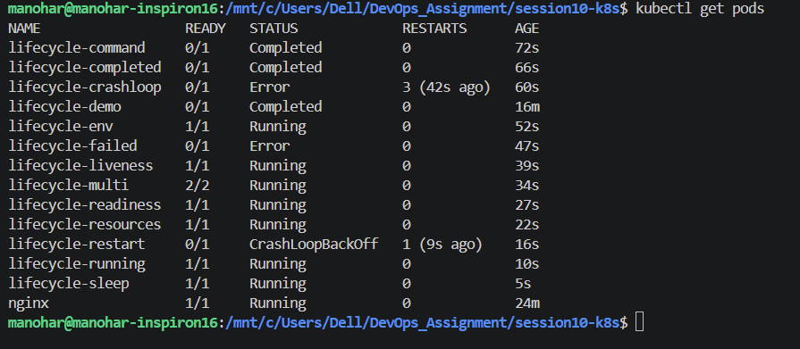

---

## Task 6: ReplicaSet and StatefulSet

### Description

Created and compared a ReplicaSet and a StatefulSet to understand how Kubernetes manages replicated workloads and stateful applications.

### ReplicaSet Manifest

```yaml
apiVersion: apps/v1
kind: ReplicaSet
metadata:
  name: nginx-rs
spec:
  replicas: 3
  selector:
    matchLabels:
      app: nginx-rs
  template:
    metadata:
      labels:
        app: nginx-rs
    spec:
      containers:
        - name: nginx
          image: nginx
```

### StatefulSet Manifest

```yaml
apiVersion: apps/v1
kind: StatefulSet
metadata:
  name: nginx-stateful
spec:
  serviceName: nginx-stateful
  replicas: 3
  selector:
    matchLabels:
      app: nginx-stateful
  template:
    metadata:
      labels:
        app: nginx-stateful
    spec:
      containers:
        - name: nginx
          image: nginx
```

### Commands

```bash
kubectl apply -f replicaset.yaml
kubectl get replicasets
kubectl get pods

kubectl apply -f statefulset.yaml
kubectl get statefulsets
kubectl get pods
```

### Output

```text
NAME               READY   STATUS      RESTARTS   AGE
lifecycle-demo     0/1     Completed   0          28m
nginx              1/1     Running     0          36m
nginx-rs-kn9lt     1/1     Running     0          91s
nginx-rs-mc6wq     1/1     Running     0          91s
nginx-rs-pbxz4     1/1     Running     0          91s
nginx-stateful-0   1/1     Running     0          46s
nginx-stateful-1   1/1     Running     0          44s
nginx-stateful-2   1/1     Running     0          41s
```

### Comparison

| Feature         | ReplicaSet                          | StatefulSet                            |
| --------------- | ----------------------------------- | -------------------------------------- |
| Main purpose    | Maintain a number of identical Pods | Manage stateful applications           |
| Pod identity    | Usually interchangeable             | Stable, unique identity                |
| Pod naming      | Generated names                     | Ordered names such as `pod-0`, `pod-1` |
| Stable identity | No                                  | Yes                                    |
| Common use      | Stateless workloads                 | Databases and other stateful workloads |

### Screenshot

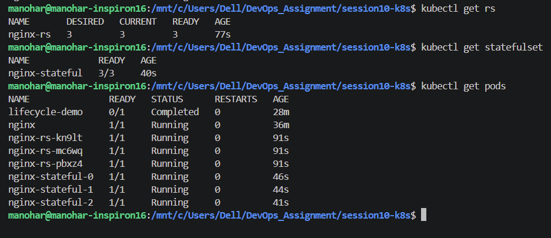

---

## Task 7: DaemonSet

### Description

Created a DaemonSet to ensure that a copy of a Pod runs on every eligible node.

### Manifest

```yaml
apiVersion: apps/v1
kind: DaemonSet
metadata:
  name: nginx-daemon
spec:
  selector:
    matchLabels:
      app: nginx-daemon
  template:
    metadata:
      labels:
        app: nginx-daemon
    spec:
      containers:
        - name: nginx
          image: nginx
```

### Commands

```bash
kubectl apply -f daemonset.yaml
kubectl get daemonsets
kubectl get pods -o wide
```

### Output

```text
nginx-daemon-8dxmb   1/1     Running     0          15s     10.244.0.24   minikube   <none>           <none>
```

### Explanation

A DaemonSet ensures that a Pod is scheduled on each eligible node. It is commonly used for node-level workloads such as logging agents, monitoring agents, and networking components.

### Screenshot

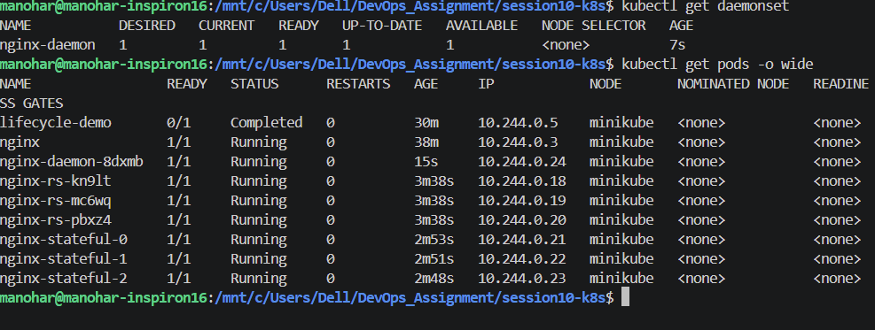

---

## Task 8: Rolling Update and Rollback

### Description

Performed a rolling update of a Deployment and then rolled the Deployment back to its previous revision.

### Deployment Manifest

```yaml
apiVersion: apps/v1
kind: Deployment
metadata:
  name: nginx-deployment
spec:
  replicas: 3
  selector:
    matchLabels:
      app: nginx
  template:
    metadata:
      labels:
        app: nginx
    spec:
      containers:
        - name: nginx
          image: nginx:1.25
```

### Commands

```bash
kubectl apply -f deployment.yaml

kubectl get deployments
kubectl get pods

kubectl set image deployment/nginx-deployment nginx=nginx:1.26

kubectl rollout status deployment/nginx-deployment
kubectl rollout history deployment/nginx-deployment

kubectl rollout undo deployment/nginx-deployment
kubectl rollout status deployment/nginx-deployment
```

### Output

```text
Name:                   nginx-deployment
Namespace:              default
CreationTimestamp:      Sat, 19 Sep 2026 18:43:17 +0000
Labels:                 <none>
Annotations:            deployment.kubernetes.io/revision: 3
Selector:               app=nginx-deployment
Replicas:               3 desired | 3 updated | 3 total | 3 available | 0 unavailable
StrategyType:           RollingUpdate
MinReadySeconds:        0
RollingUpdateStrategy:  0 max unavailable, 1 max surge
Pod Template:
  Labels:  app=nginx-deployment
  Containers:
   nginx:
    Image:         nginx:1.25
    Port:          <none>
    Host Port:     <none>
    Environment:   <none>
    Mounts:        <none>
  Volumes:         <none>
  Node-Selectors:  <none>
  Tolerations:     <none>
Conditions:
  Type           Status  Reason
  ----           ------  ------
  Available      True    MinimumReplicasAvailable
  Progressing    True    NewReplicaSetAvailable
OldReplicaSets:  nginx-deployment-7b4b94797f (0/0 replicas created)
NewReplicaSet:   nginx-deployment-6ff9847f4 (3/3 replicas created)
Events:
  Type    Reason             Age               From                   Message
  ----    ------             ----              ----                   -------
  Normal  ScalingReplicaSet  3m54s             deployment-controller  Scaled up replica set nginx-deployment-6ff9847f4 from 0 to 3
  Normal  ScalingReplicaSet  2m25s             deployment-controller  Scaled up replica set nginx-deployment-7b4b94797f from 0 to 1
  Normal  ScalingReplicaSet  59s               deployment-controller  Scaled down replica set nginx-deployment-6ff9847f4 from 3 to 2
  Normal  ScalingReplicaSet  59s               deployment-controller  Scaled up replica set nginx-deployment-7b4b94797f from 1 to 2
  Normal  ScalingReplicaSet  58s               deployment-controller  Scaled down replica set nginx-deployment-6ff9847f4 from 2 to 1
  Normal  ScalingReplicaSet  58s               deployment-controller  Scaled up replica set nginx-deployment-7b4b94797f from 2 to 3
  Normal  ScalingReplicaSet  57s               deployment-controller  Scaled down replica set nginx-deployment-6ff9847f4 from 1 to 0
  Normal  ScalingReplicaSet  10s               deployment-controller  Scaled up replica set nginx-deployment-6ff9847f4 from 0 to 1
  Normal  ScalingReplicaSet  10s               deployment-controller  Scaled down replica set nginx-deployment-7b4b94797f from 3 to 2
  Normal  ScalingReplicaSet  8s (x4 over 10s)  deployment-controller  (combined from similar events): Scaled down replica set nginx-deployment-7b4b94797f from 1 to 0
```

### Explanation

A **rolling update** gradually replaces existing Pods with Pods running the new version. This allows the application to remain available during the update.

A **rollback** restores the Deployment to a previous revision when the new version needs to be reverted.

### Screenshot

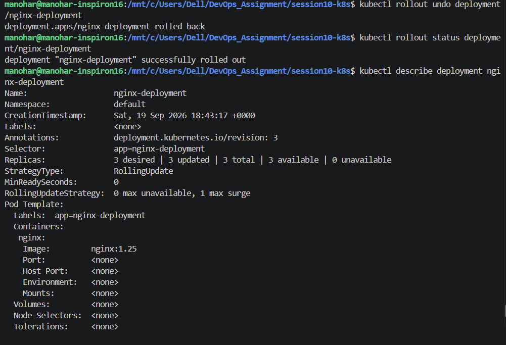

---

## Task 9: Kubernetes Troubleshooting

### Description

Used Kubernetes inspection and troubleshooting commands to identify the cause of Pod and workload problems.

### Commands

```bash
kubectl get pods
kubectl describe pod <pod-name>
kubectl logs <pod-name>
kubectl get events --sort-by=.lastTimestamp
kubectl get deployments
kubectl describe deployment <deployment-name>
```

### Troubleshooting Process

The general troubleshooting process is:

1. Check the Pod status using `kubectl get pods`.
2. Inspect the Pod using `kubectl describe pod`.
3. Check container logs using `kubectl logs`.
4. Inspect recent cluster events.
5. Check the Deployment or controller managing the Pod.
6. Identify the root cause from the status, events, and logs.
7. Apply the required correction and verify the workload again.

### Output

```text
NAME               READY   STATUS   RESTARTS   AGE
troubleshoot-pod   0/1     Error    0          7s
```

### Screenshot

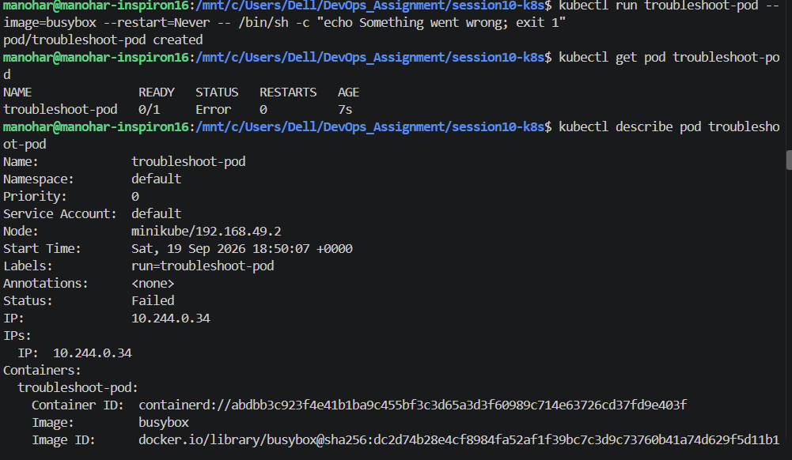


---

# Task 10: Kubernetes Concepts and Theory

## 10.1 Kubernetes Ports

Kubernetes uses different types of ports for communication.

### containerPort

`containerPort` documents the port on which a container listens.

Example:

```yaml
ports:
  - containerPort: 80
```

### targetPort

`targetPort` is the port on the Pod to which a Kubernetes Service forwards traffic.

### port

`port` is the port exposed by the Kubernetes Service.

### nodePort

`nodePort` exposes a Service on a port on each node, normally within the Kubernetes NodePort range.

---

## 10.2 Labels and Selectors

**Labels** are key-value pairs attached to Kubernetes objects.

Example:

```yaml
labels:
  app: nginx
```

**Selectors** are used by Kubernetes objects such as Services and Deployments to identify resources with matching labels.

Example:

```yaml
selector:
  app: nginx
```

The label and selector must match correctly for the related Kubernetes components to work together.

---

## 10.3 Deployment Strategies

Kubernetes Deployments support different rollout strategies.

### RollingUpdate

The `RollingUpdate` strategy gradually replaces old Pods with new Pods.

It is useful when an application needs to remain available during deployment.

### Recreate

The `Recreate` strategy terminates the existing Pods before creating the new Pods.

This can result in downtime during the update.

---

## 10.4 maxSurge

`maxSurge` controls how many additional Pods can be created above the desired replica count during a rolling update.

For example:

```yaml
strategy:
  rollingUpdate:
    maxSurge: 1
```

This allows Kubernetes to temporarily create one additional Pod above the desired number.

---

## 10.5 maxUnavailable

`maxUnavailable` controls how many Pods can be unavailable during a rolling update.

Example:

```yaml
strategy:
  rollingUpdate:
    maxUnavailable: 1
```

This limits the number of unavailable Pods during the update.

---

## 10.6 Resource Requests and Limits

### Requests

A resource request specifies the minimum amount of CPU or memory that Kubernetes should reserve for a container when scheduling it.

Example:

```yaml
resources:
  requests:
    cpu: "100m"
    memory: "64Mi"
```

### Limits

A resource limit specifies the maximum CPU or memory a container is allowed to consume.

Example:

```yaml
resources:
  limits:
    cpu: "250m"
    memory: "128Mi"
```

---

## 10.7 GB vs GiB

**GB** is based on decimal units:

```text
1 GB = 1,000,000,000 bytes
```

**GiB** is based on binary units:

```text
1 GiB = 1,073,741,824 bytes
```

Kubernetes commonly uses binary units such as `Mi` and `Gi` for memory.

For example:

```text
128Mi
1Gi
```

---

# Task 11: Blue-Green Deployment

### Description

A blue-green deployment maintains two application environments:

* **Blue** - the currently active version.
* **Green** - the new version.

Traffic can be switched from Blue to Green by changing the Service selector.

### Blue Deployment

```yaml
apiVersion: apps/v1
kind: Deployment
metadata:
  name: app-blue
spec:
  replicas: 2
  selector:
    matchLabels:
      app: demo
      version: blue
  template:
    metadata:
      labels:
        app: demo
        version: blue
    spec:
      containers:
        - name: nginx
          image: nginx:1.25
```

### Green Deployment

```yaml
apiVersion: apps/v1
kind: Deployment
metadata:
  name: app-green
spec:
  replicas: 2
  selector:
    matchLabels:
      app: demo
      version: green
  template:
    metadata:
      labels:
        app: demo
        version: green
    spec:
      containers:
        - name: nginx
          image: nginx:1.26
```

### Service

```yaml
apiVersion: v1
kind: Service
metadata:
  name: demo-service
spec:
  selector:
    app: demo
    version: blue
  ports:
    - port: 80
      targetPort: 80
```

### Commands

```bash
kubectl apply -f blue.yaml
kubectl apply -f green.yaml
kubectl apply -f service.yaml

kubectl get deployments
kubectl get pods
kubectl get service
```

To switch traffic to Green:

```bash
kubectl patch service demo-service -p '{"spec":{"selector":{"app":"demo","version":"green"}}}'
```

### Screenshot

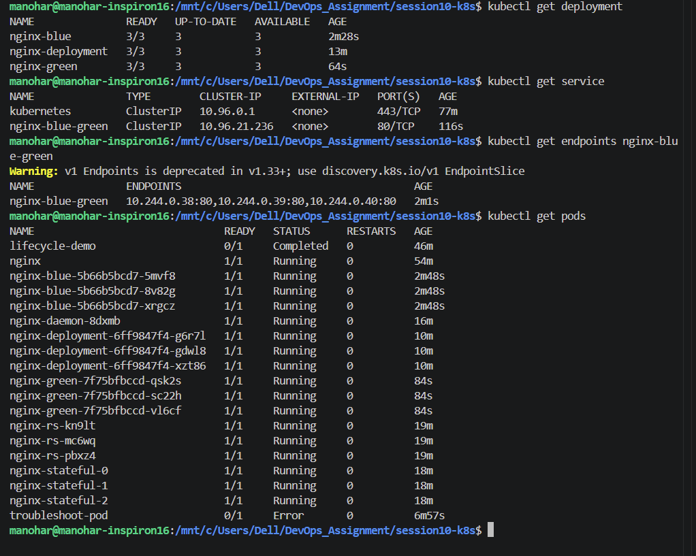

---

# Task 12: Canary Deployment

### Description

A canary deployment gradually introduces a new application version while the existing version continues serving traffic.

A simple Kubernetes implementation can use multiple Deployments with the same application label and different version labels, with the Service selecting the common application label.

### Stable Deployment

```yaml
apiVersion: apps/v1
kind: Deployment
metadata:
  name: app-stable
spec:
  replicas: 4
  selector:
    matchLabels:
      app: canary-demo
      version: stable
  template:
    metadata:
      labels:
        app: canary-demo
        version: stable
    spec:
      containers:
        - name: nginx
          image: nginx:1.25
```

### Canary Deployment

```yaml
apiVersion: apps/v1
kind: Deployment
metadata:
  name: app-canary
spec:
  replicas: 1
  selector:
    matchLabels:
      app: canary-demo
      version: canary
  template:
    metadata:
      labels:
        app: canary-demo
        version: canary
    spec:
      containers:
        - name: nginx
          image: nginx:1.26
```

### Service

```yaml
apiVersion: v1
kind: Service
metadata:
  name: canary-service
spec:
  selector:
    app: canary-demo
  ports:
    - port: 80
      targetPort: 80
```

### Commands

```bash
kubectl apply -f stable.yaml
kubectl apply -f canary.yaml
kubectl apply -f canary-service.yaml

kubectl get deployments
kubectl get pods
kubectl get service
```

### Explanation

Because the Service selects both versions using the common `app` label, traffic can be distributed between the stable and canary Pods according to the number of replicas available.

### Screenshot

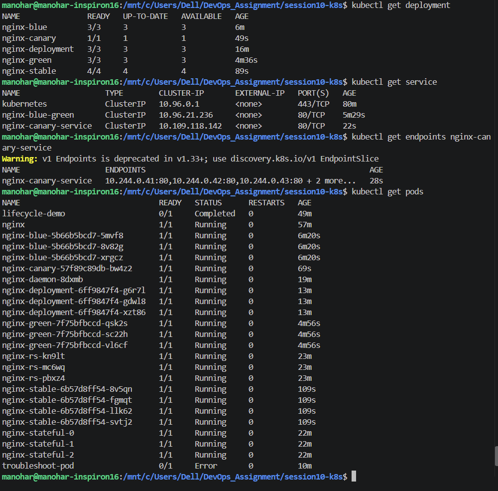

---

# Task 13: Recreate Deployment Strategy

### Description

Demonstrated the `Recreate` deployment strategy, where existing Pods are terminated before new Pods are created.

### Manifest

```yaml
apiVersion: apps/v1
kind: Deployment
metadata:
  name: recreate-demo
spec:
  replicas: 3
  strategy:
    type: Recreate
  selector:
    matchLabels:
      app: recreate-demo
  template:
    metadata:
      labels:
        app: recreate-demo
    spec:
      containers:
        - name: nginx
          image: nginx:1.25
```

### Commands

```bash
kubectl apply -f recreate.yaml
kubectl get deployment
kubectl get pods
```

### Explanation

With the `Recreate` strategy, Kubernetes terminates the existing Pods before creating Pods with the new version. This can cause temporary application downtime during the update.

### Screenshot

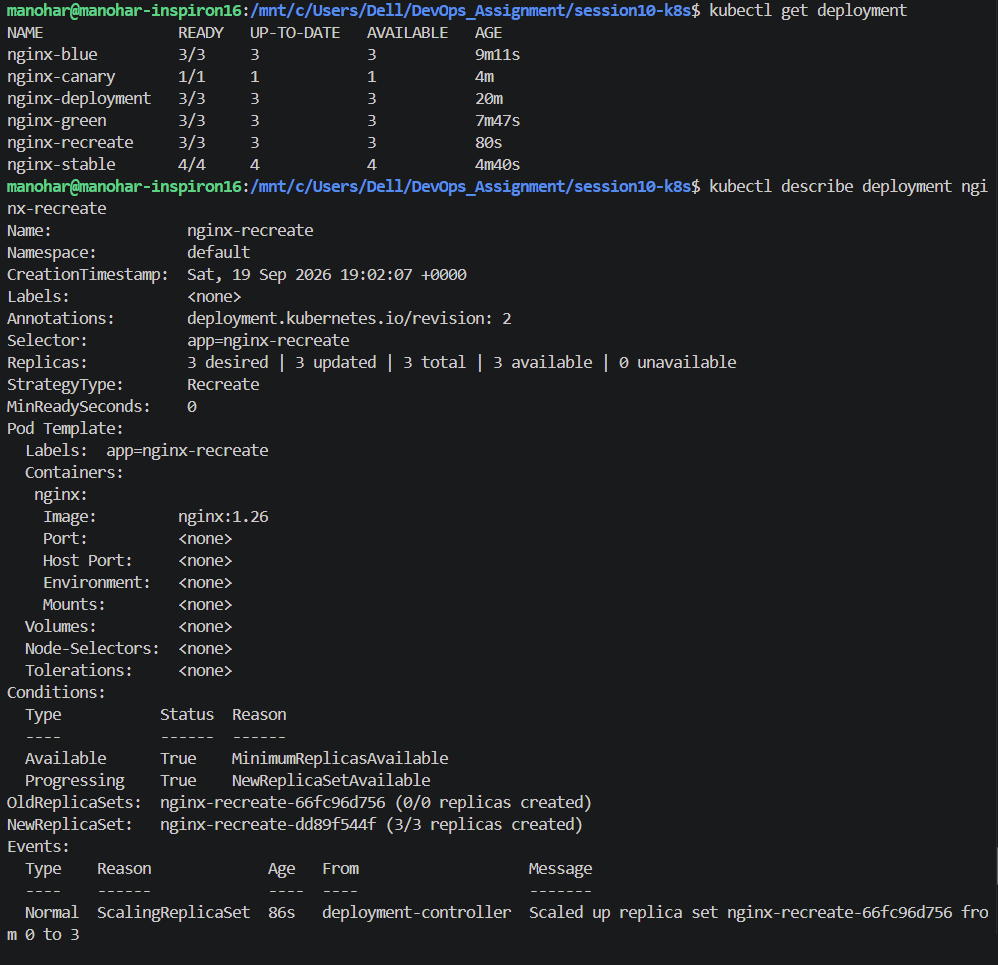

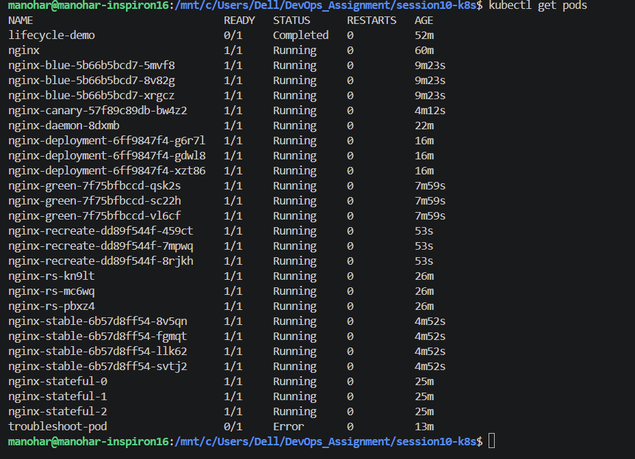

---