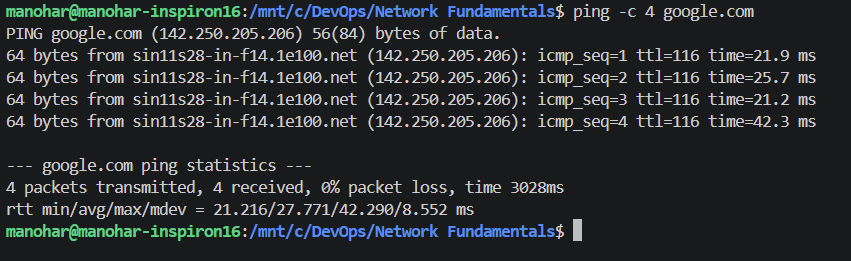
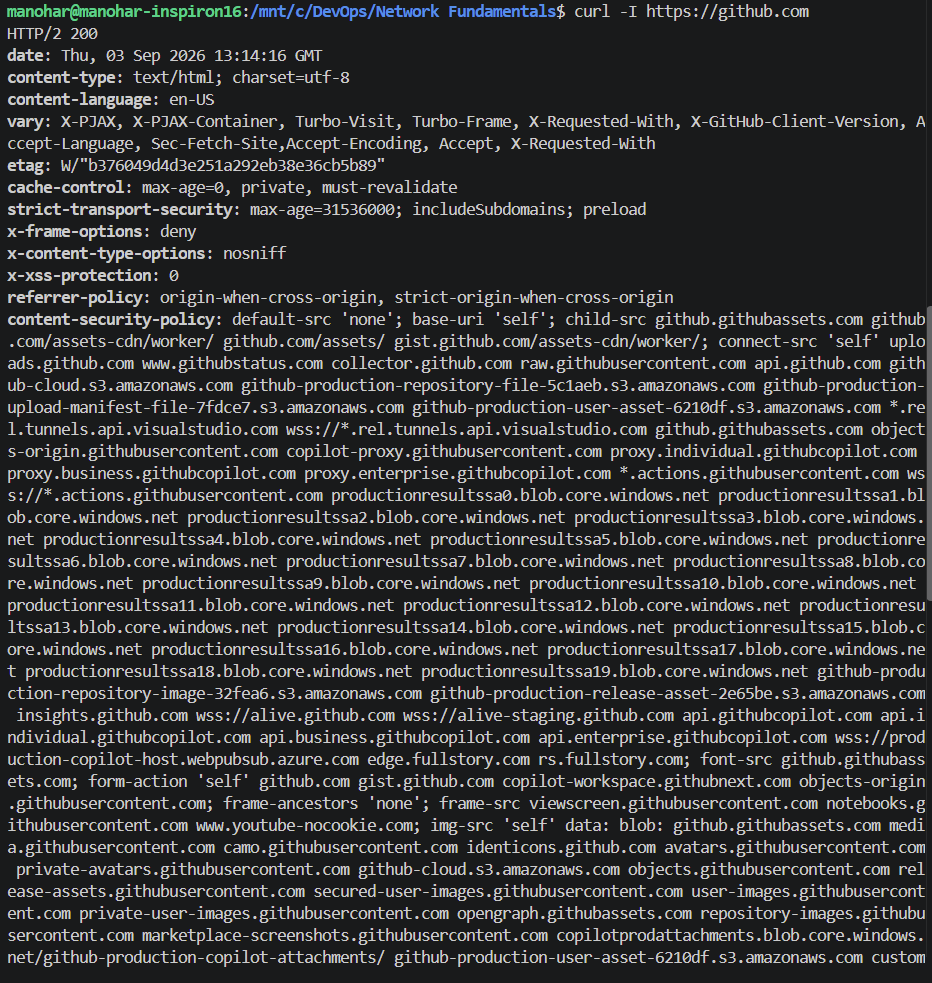
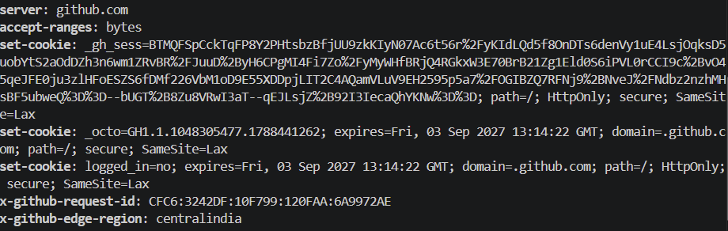
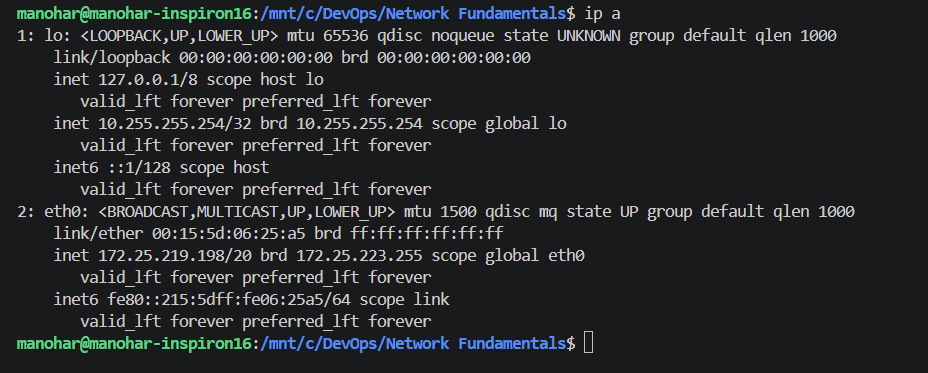
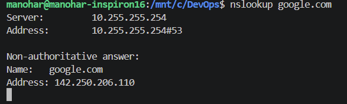

## Command Execution and Explanations

Below are the outputs and my explanations for the essential networking commands I executed.

### 1. `ping`
**Command Executed:** `ping -c 4 google.com`

**Explanation:** The `ping` command sends ICMP ECHO_REQUEST packets to a network host. I understood that it is primarily used to verify that a specific IP address or domain is accessible and to measure the time it takes for packets to travel there and back (latency).

### 2. `curl`
**Command Executed:** `curl -I https://github.com`

**Explanation:** The `curl` command transfers data to or from a server. By using the `-I` flag, it only fetches the HTTP headers. I learned this is a great way to check if a web service is running and returning a successful status code (like `HTTP/2 200`) without downloading the entire page body.

### 3. `ip a` 
**Command Executed:** `ip a` (or `ipconfig`)

**Explanation:** This command displays all the network interfaces attached to the system and their assigned IP addresses. I understood that this is crucial for finding the local/private IP address of my machine and checking the status of my network adapters.

### 4. `nslookup`
**Command Executed:** `nslookup google.com`

**Explanation:** `nslookup` is a network administration tool used to query the Domain Name System (DNS). I understood that it translates human-readable domain names (like google.com) into the actual numerical IP addresses that computers use to communicate.