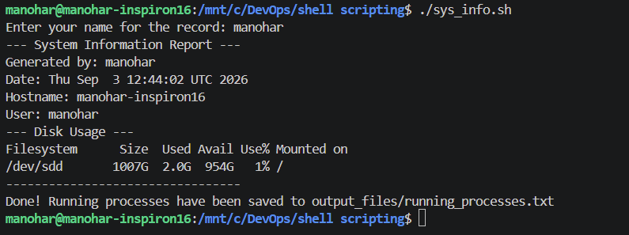
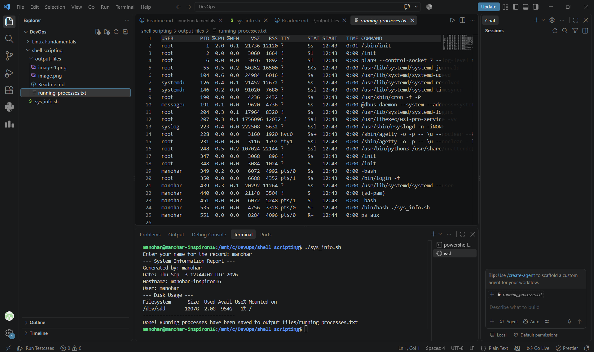

### Shell Scripting

Below are the screenshots demonstrating the successful execution of the system information script:

**1. Running the script and providing user input in the terminal:**

**2. The script displaying the system information output in the terminal:**

**3. The redirected process output successfully saved and viewed in VS Code:**
